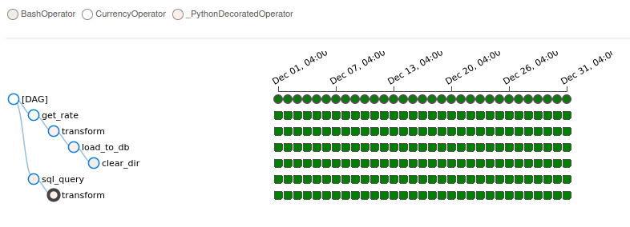

# Pipeline по курсу валют

## Задача: 
> 1)Получить данные из базы и обогатить их данными по курсу валют RUB   
> 2)Посчитать итоговую сумму в рублях сколько получилось валюты  
> 3)Загрузить обогащенные данные в базу  
> 4)Настроить уведомление об ошибках в даге на telegram  

&ensp;
### Структура дага 
  
**get_rate** Получает курс валюты по API и сохраняет результат в XCOM.  
**sql_query** Делает запрос и получает данные из БД за день выполнения таска и сохраняет результат в XCOM.   
Данных не моного можем использовать XCOM для хранения информации.  

**transform** Обогащает курсом валют данные и загружает отчет в csv файл на локальной машине.  
**load_to_db** Загружает отчет в базу   
**clear_dir**  Удаляем старые отчеты  

&ensp;
## Запускаем 2 контейнера с PostgreSQL
**База метаданных для Airflow**
~~~
docker run --name POSTGRES_AIRFLOW --rm -d -p 6666:5432 -e POSTGRES_PASSWORD=postgres -e POSTGRES_USER=postgres -e POSTGRES_DB=airflow -v postgres_data_airflow:/var/lib/postgresql/data postgres
~~~

**Основная база для хранения информации**
~~~
docker run --name POSTGRES_PIPELINE --rm -d -p 5555:5432 -e POSTGRES_PASSWORD=postgres -e POSTGRES_USER=postgres -e POSTGRES_DB=pipeline -v data_pipeline:/var/lib/postgresql/data postgres
~~~

&ensp;
## Шаг 1: Получаем данные по курсу валюты за день через API  

**Пользовательский hook**  
~~~
from airflow.hooks.base import BaseHook

class CurrencyHook(BaseHook):
    def __init__(self, **kwargs):
        super().__init__(**kwargs)

    def get_currency(self, date, base, symbols) -> float:
        """ Выгружает курс валюты за день
        :param base: Базовая валюта
        :param symbols: Другая валюта относительно базовой (Например евро к рублю)
        """
        import requests

        params = {
            'start_date': date,
            'end_date': date,
            'base': base,
            'symbols': symbols,
            'format': 'json'
        }
        url = 'https://api.exchangerate.host/timeseries'
        response = requests.get(url, params=params)
        return response.json()['rates'][date]['RUB']
~~~

**Пользовательский оператор**  
~~~
from airflow.models.baseoperator import BaseOperator
from ..hooks.currency_hook import CurrencyHook

class CurrencyOperator(BaseOperator):
    def __init__(self, base: str = 'USD', symbols: str = 'RUB', **kwargs):
        super().__init__(**kwargs)
        self.base = base
        self.symbols = symbols

    def execute(self, context):
        currency_hook = CurrencyHook()
        rate = currency_hook.get_currency(date=context['ds'], base=self.base, symbols=self.symbols)
        return rate
~~~

&ensp;
## Шаг 2: Получаем данные из базы  

В базе хранится информация по дате, валюте и количеству валюты  

~~~
@task
def sql_query(ds=None):
	""" Получает данные из БД за день выполнения DAG и сохраняет результат в XCOM """

	pg_hook_book = PostgresHook(postgres_conn_id='pipeline_1')
	engine = pg_hook_book.get_sqlalchemy_engine()

	sql = f"""
		SELECT
			nt."date"
			,nt.currency
			,nt.value
		FROM public.newtable nt
		WHERE nt."date" = '{ds}'
	   """
	df = pd.read_sql(sql=sql, con=engine)
	sql_result = df.to_json()
	return sql_result
~~~

&ensp;
## Шаг 3: Добавляем данные по валюте в рублях  

~~~
@task()
def transform(sql_result):
	""" Получет данные из XCOM обогащает данные из базы курсом валют и загружает отчет в csv файл """
	context = get_current_context()
	currency_rate = context['ti'].xcom_pull(task_ids='get_rate')
	df = pd.read_json(sql_result)
	df['rub_rate'] = currency_rate
	df['sum_usd_rub'] = df.apply(lambda row: round(row['value'] * row['rub_rate'], 2), axis=1)
	df.to_csv(f"/home/master/airflow/data/report_{context['ds']}.csv", index=False)
~~~

&ensp;
## Шаг 4: Загружаем отчет в базу

~~~
@task
def load_to_db():
	""" Загружает отчет в базу """
	context = get_current_context()
	pg_hook = PostgresHook('pipeline_1')
	engine = pg_hook.get_sqlalchemy_engine()

	df = pd.read_csv(f"/home/master/airflow/data/report_{context['ds']}.csv")
	df.to_sql(name='report', con=engine, schema='main', if_exists='append', index=False)
~~~

&ensp;
## Шаг 5: Удаляем старые отчеты
~~~
clear_dir = BashOperator(task_id='clear_dir',
                             bash_command="rm /home/master/airflow/data/report_{{ ds }}.csv")

~~~

&ensp;
## Шаг 6: Добавляем уведомление об ошибках в tg 

~~~
def on_failure_callback(context):
    """ Уведомление об ошибке дага в tg """
    ti = context['ti']
    send_message = TelegramOperator(
        task_id='send_message_telegram',
        telegram_conn_id='telegram_id',
        chat_id='-1001745042397',
        text=f"Ошибка в Даге:{ti.dag_id} задачa: {ti.task_id}, Дата запуска: {context['ds']}")
    return send_message.execute(context)
~~~

**Получим ошибку если даг упадет со статусом failed**   

&ensp; 
## Полный DAG
~~~
import pandas as pd
from datetime import datetime
from airflow import DAG
from airflow.decorators import task
from airflow.providers.postgres.hooks.postgres import PostgresHook
from airflow.providers.telegram.operators.telegram import TelegramOperator
from currency.operators.corrency_operatop import CurrencyOperator
from airflow.operators.python import get_current_context
from airflow.operators.bash import BashOperator

def on_failure_callback(context):
    """ Уведомление об ошибке дага в tg """
    ti = context['ti']
    send_message = TelegramOperator(
        task_id='send_message_telegram',
        telegram_conn_id='telegram_id',
        chat_id='-1001745042397',
        text=f"Ошибка в Даге:{ti.dag_id} задачa: {ti.task_id}, Дата запуска: {context['ds']}")
    return send_message.execute(context)

with DAG(dag_id='CURRENSY_PIPELINE',
         start_date=datetime(2021, 12, 1),
         end_date=datetime(2021, 12, 31),
         on_failure_callback=on_failure_callback,
         schedule_interval='@daily',
         tags=['IVAN'],
         default_args={'owner': 'Ivan.L'}) as dag:

    """ Получаем курс валюты по API и сохраняет результат в XCOM"""
    get_rate = CurrencyOperator(task_id='get_rate')
    
    @task
    def sql_query(ds=None):
        """ Получает данные из БД за день выполнения DAG и сохраняет результат в XCOM """

        pg_hook_book = PostgresHook(postgres_conn_id='pipeline_1')
        engine = pg_hook_book.get_sqlalchemy_engine()

        sql = f"""
               SELECT
       	        nt."date"
       	        ,nt.currency
       	        ,nt.value
               FROM public.newtable nt
               WHERE nt."date" = '{ds}'
               """
        df = pd.read_sql(sql=sql, con=engine)
        sql_result = df.to_json()
        return sql_result

    @task()
    def transform(sql_result):
        """ Получет данные из XCOM обогащает данные из базы курсом валют и загружает отчет в csv файл """
        context = get_current_context()
        currency_rate = context['ti'].xcom_pull(task_ids='get_rate')
        df = pd.read_json(sql_result)
        df['rub_rate'] = currency_rate
        df['sum_usd_rub'] = df.apply(lambda row: round(row['value'] * row['rub_rate'], 2), axis=1)
        df.to_csv(f"/home/master/airflow/data/report_{context['ds']}.csv", index=False)

    @task
    def load_to_db():
        """ Загружает отчет в базу """
        context = get_current_context()
        pg_hook = PostgresHook('pipeline_1')
        engine = pg_hook.get_sqlalchemy_engine()
        
        df = pd.read_csv(f"/home/master/airflow/data/report_{context['ds']}.csv")
        df.to_sql(name='report', con=engine, schema='main', if_exists='append', index=False)

    """ Удаляем старые отчеты """
    clear_dir = BashOperator(task_id='clear_dir',
                             bash_command="rm /home/master/airflow/data/report_{{ ds }}.csv")

    sql_query = sql_query()
    transform = transform(sql_result=sql_query)
    load_to_db = load_to_db()
    [get_rate, sql_query] >> transform >> load_to_db >> clear_dir

~~~

## Запускаем DAG с 2021-12-01 по 2021-12-31

&ensp; 

**После загрузки мы получим в базе таблицу с отчетами по дням и курсом валют USD to RUB**
  

&ensp;
## Если нужно загрузить исторические данные запускаем backfill
**Догружаем Январь и Июнь 2021**
~~~
airflow dags backfill \
    --start-date 2021-01-01 \
    --end-date 2021-01-31 \
    CURRENSY_PIPELINE

airflow dags backfill \
    --start-date 2021-06-01 \
    --end-date 2021-06-30 \
    CURRENSY_PIPELINE
~~~

