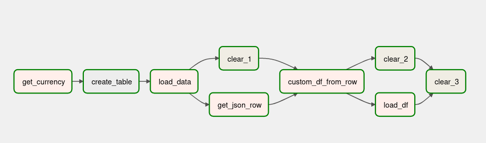
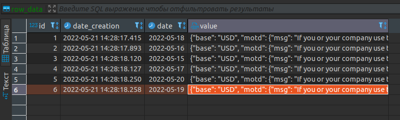
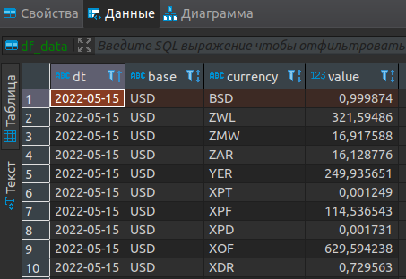

## Цель
**1)Получить данные из API  
2)Загрузить сырые данные в базу  
3)Получить сырые данные из базы и обработать их  
4)Загрузить обработанные данные в базу** 

## Структура дага

**get_currency**  Получает курс валют к USD за день  
**sql_task** Создает таблицу в базе  
**lsoad_data**  Загружает сырые данные в базу  
**get_json_row** Получаем row_json из базы за день и сохраняем в файл  
**custom_df_from_row**  Создает пользовательский DataFrame из row_json и сохранят в csv  
**load_df** Загружает csv файл DataFrame в базу
  
**Удаляет временные файлы**   
**clear_1**   
**clear_2**  
**clear_3**  

### 1) Получаем данные и сохраняем в JSON
~~~
@task
    def get_currency(ds=None):
        """" Получает курс валют к USD за день """
        import requests
        import json

        url = 'https://api.exchangerate.host/timeseries'
        params = {
            'start_date': ds,
            'end_date': ds,
            'base': 'USD',
            'format': 'json'
        }
        response = requests.get(url, params=params)
        data = response.json()

        with open(f'/home/master/airflow/data/currency_{ds}.json', 'w') as file:
            json.dump(data, file)

~~~

### 2) Создаем таблицу для загрузки сырых данных
~~~
CREATE TABLE IF NOT EXISTS pipeline."SY".row_data (
    id serial,
    date_creation timestamp DEFAULT now(),
    date date,
    value JSONB
   );
~~~

### 3) Загружаем сырые данные в базу
~~~
@task
    def load_data(ds=None):
        """ Загружает сырые данные в базу """
        import json

        with open(f'/home/master/airflow/data/currency_{ds}.json', 'r') as f:
            data = json.load(f)
            data = json.dumps(data)

        hook = PostgresHook('pipeline_1')
        hook.copy_expert(sql=f"""
        INSERT INTO pipeline."SY".row_data (value, date)
        VALUES ('{data}', '{ds}')
        """, filename='Hello')
~~~
**Row данные после загрузки в базу**

### 4) Получаем сырые данные из базы и соханяем в JSON
Для примера тут я не использую файлы которые мы получили в get_currency,
        чтобы поработать с данными из row слоя базы

~~~
@task
    def get_json_row(ds=None):
        """ Получаем row_json из базы за день и сохраняем в файл """
        """
        Для примера тут я не использую файлы которые мы получили в get_currency,
        чтобы поработать с данными из row слоя базы
        """

        import pandas as pd
        import json

        hook = PostgresHook('pipeline_1')
        engine = hook.get_sqlalchemy_engine()

        df = pd.read_sql(
            sql=f""" SELECT
        	            rd."date"
        	            ,rd.value
                     FROM pipeline."SY".row_data rd
                     WHERE date = '{ds}'
                """, con=engine)

        df['value'].to_json(path_or_buf=f'/home/master/airflow/data/ROW_{ds}.json', index=False, orient='split')
~~~

### 5) Обрабатываем сырые данные из базы и получаем кастомный DataFrame
~~~
@task
    def custom_df_from_row(ds=None):
        """ Создает пользовательский DataFrame из row_json и сохранят в csv"""
        import json
        import pandas as pd

        file_path = f'/home/master/airflow/data/ROW_{ds}.json'
        df_currency = pd.DataFrame(data={'dt': ['T'],
                                         'base': 'T',
                                         'currency': 'T',
                                         'value': 0})

        with open(f'{file_path}', 'r') as f:
            value = json.load(f)

        dt = value['data'][0]['start_date']
        for currensy, value in value['data'][0]['rates'][f'{dt}'].items():
            df = pd.DataFrame(data={'dt': [f'{dt}'],
                                    'base': 'USD',
                                    'currency': f'{currensy}',
                                    'value': f'{value}'
                                    })

            df_currency = df_currency.append(df, ignore_index=True)
        df_currency = df_currency.drop([0])
        df_currency.to_csv(f"/home/master/airflow/data/df_from_row_{ds}.csv", index=False)
~~~

### 6) Загружаем DataFrame в базу
~~~
@task
    def load_df(ds=None):
        """ Загружает csv файл DataFrame в базу """
        import pandas as pd

        df = pd.read_csv(f'/home/master/airflow/data/df_from_row_{ds}.csv')
        pg_hook = PostgresHook('pipeline_1')
        engine = pg_hook.get_sqlalchemy_engine()

        df.to_sql(name='df_data', con=engine, schema='SY', if_exists='append', index=False)
~~~

**Пользовательский DataFrame после загрузки в базу**  

## Полный код DAG
~~~
from airflow import DAG
from datetime import datetime
from airflow.decorators import task
from airflow.providers.postgres.hooks.postgres import PostgresHook
from airflow.providers.postgres.operators.postgres import PostgresOperator
from airflow.operators.bash import BashOperator

with DAG(
    dag_id='C_5',
    start_date=datetime(2022, 5, 15),
    default_args={'owner': 'Ivan.L'},
    tags=['IVAN']
) as dag:

    @task
    def get_currency(ds=None):
        """" Получает курс валют к USD за день """
        import requests
        import json

        url = 'https://api.exchangerate.host/timeseries'
        params = {
            'start_date': ds,
            'end_date': ds,
            'base': 'USD',
            'format': 'json'
        }
        response = requests.get(url, params=params)
        data = response.json()

        with open(f'/home/master/airflow/data/currency_{ds}.json', 'w') as file:
            json.dump(data, file)

    sql_task = PostgresOperator(task_id='create_table',
                                postgres_conn_id='pipeline_1',
                                sql='sql/creat_table_2.sql')
    
    @task
    def load_data(ds=None):
        """ Загружает сырые данные в базу """
        import json

        with open(f'/home/master/airflow/data/currency_{ds}.json', 'r') as f:
            data = json.load(f)
            data = json.dumps(data)

        hook = PostgresHook('pipeline_1')
        hook.copy_expert(sql=f"""
        INSERT INTO pipeline."SY".row_data (value, date)
        VALUES ('{data}', '{ds}')
        """, filename='Hello')

    clear_1 = BashOperator(task_id='clear_1',
                             bash_command="rm /home/master/airflow/data/currency_{{ ds }}.json ")

    @task
    def get_json_row(ds=None):
        """ Получаем row_json из базы за день и сохраняем в файл """
        """
        Для примера тут я не использую файлы которые мы получили в get_currency,
        чтобы поработать с данными из row слоя базы
        """

        import pandas as pd
        import json

        hook = PostgresHook('pipeline_1')
        engine = hook.get_sqlalchemy_engine()

        df = pd.read_sql(
            sql=f""" SELECT
        	            rd."date"
        	            ,rd.value
                     FROM pipeline."SY".row_data rd
                     WHERE date = '{ds}'
                """, con=engine)

        df['value'].to_json(path_or_buf=f'/home/master/airflow/data/ROW_{ds}.json', index=False, orient='split')

    @task
    def custom_df_from_row(ds=None):
        """ Создает пользовательский DataFrame из row_json и сохранят в csv"""
        import json
        import pandas as pd

        file_path = f'/home/master/airflow/data/ROW_{ds}.json'
        df_currency = pd.DataFrame(data={'dt': ['T'],
                                         'base': 'T',
                                         'currency': 'T',
                                         'value': 0})

        with open(f'{file_path}', 'r') as f:
            value = json.load(f)

        dt = value['data'][0]['start_date']
        for currensy, value in value['data'][0]['rates'][f'{dt}'].items():
            df = pd.DataFrame(data={'dt': [f'{dt}'],
                                    'base': 'USD',
                                    'currency': f'{currensy}',
                                    'value': f'{value}'
                                    })

            df_currency = df_currency.append(df, ignore_index=True)
        df_currency = df_currency.drop([0])
        df_currency.to_csv(f"/home/master/airflow/data/df_from_row_{ds}.csv", index=False)

    clear_2 = BashOperator(task_id='clear_2',
                             bash_command="rm /home/master/airflow/data/ROW_{{ds}}.json")

    @task
    def load_df(ds=None):
        """ Загружает csv файл DataFrame в базу """
        import pandas as pd

        df = pd.read_csv(f'/home/master/airflow/data/df_from_row_{ds}.csv')
        pg_hook = PostgresHook('pipeline_1')
        engine = pg_hook.get_sqlalchemy_engine()

        df.to_sql(name='df_data', con=engine, schema='SY', if_exists='append', index=False)

    clear_3 = BashOperator(task_id='clear_3',
                             bash_command="rm /home/master/airflow/data/df_from_row_{{ds}}.csv")

    get_currency() >> sql_task >> load_data() >> [clear_1, get_json_row()] >> custom_df_from_row() >> [clear_2, load_df()] >> clear_3
~~~
