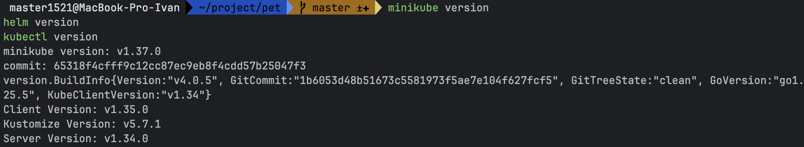
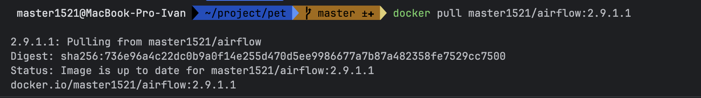
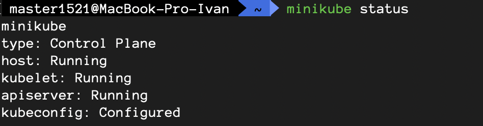
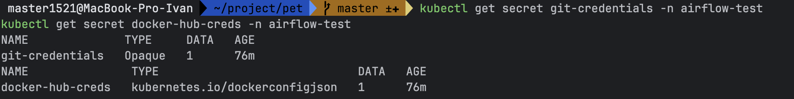
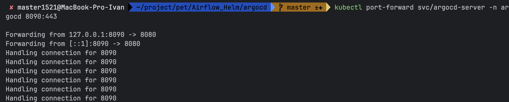
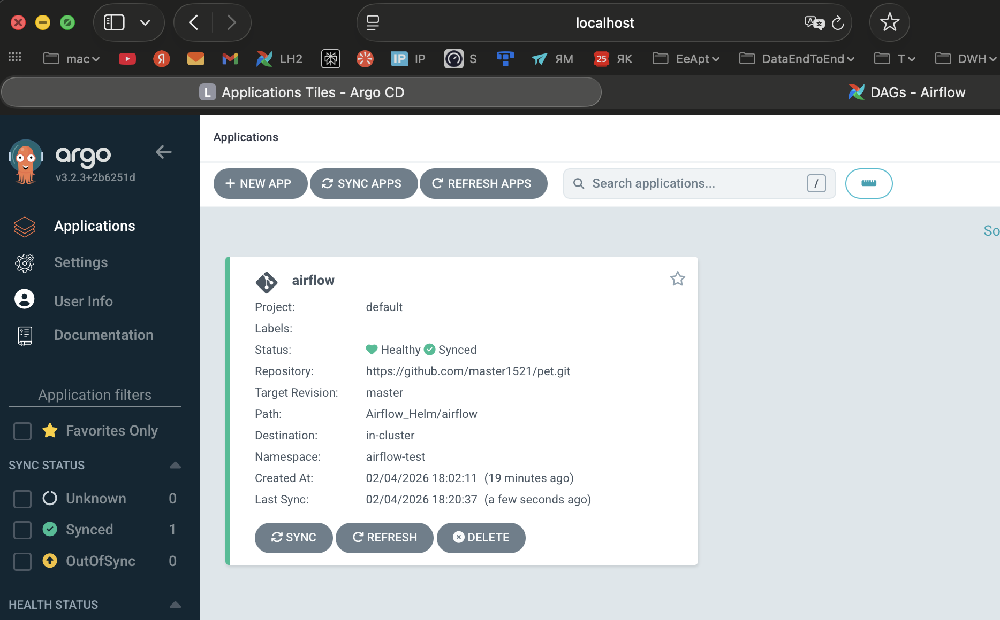
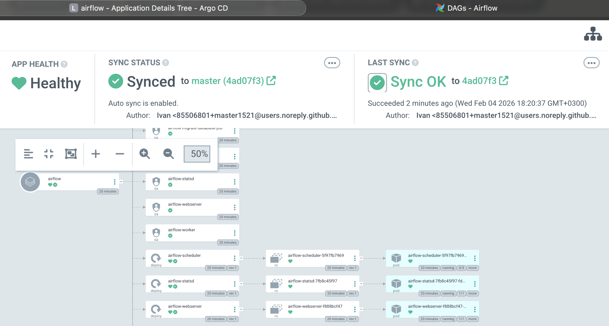
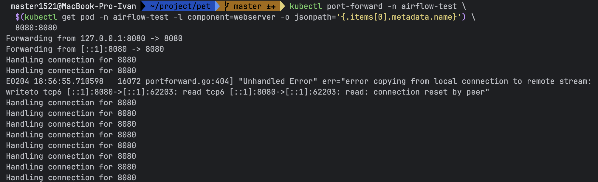
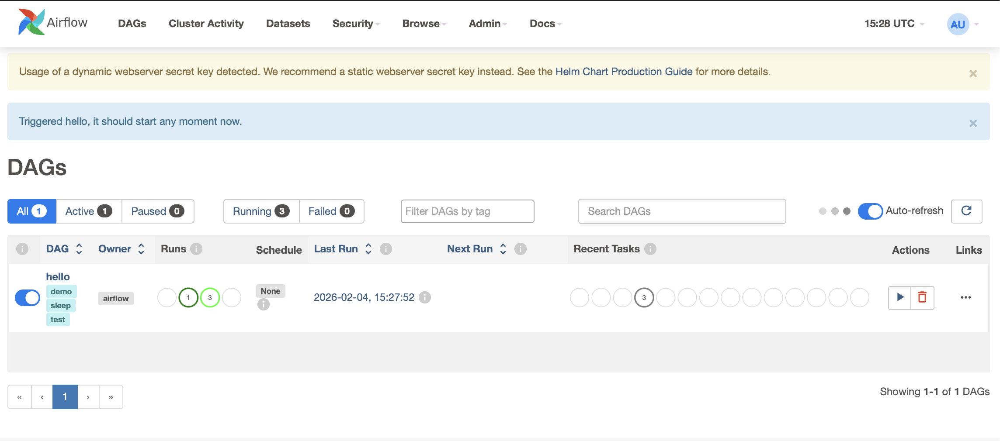
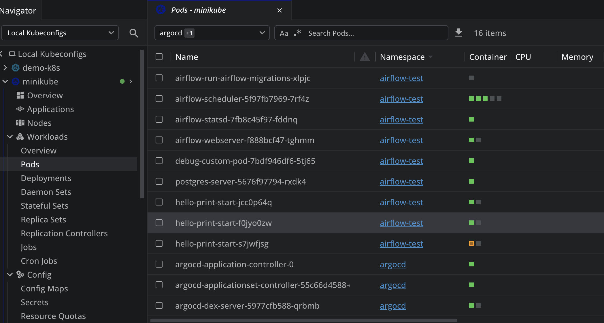

# Airflow Helm ArgoCd

Cтенд для проверки образов, пакетов и дагов Airflow     

### Установка     
Устанавливаем minikube, helm, kubectl на пк по инструкциям из интернета    

### Проверка установки    
~~~
minikube version
helm version
kubectl version
~~~

~~~
Собрал и загрузил кастомный образ Airflow в приватный репозиторий для образов, это может быть Docker Hub, Harbor и тд
master1521/airflow:2.9.1.1
Надо проверить что образ скачивается из под этой учетки, она используются для создания секрета в кубере
  --docker-username='XXXXXXXXXXXX' 
  --docker-password='XXXXXXXXXXXX' 
~~~

### Запустить кластер   
~~~
minikube start 
minikube status
~~~

### Создать namespace    
~~~
kubectl create namespace airflow-test
kubectl create namespace argocd
kubectl get ns
~~~

### Создать секрет для скачивания образа   
~~~
kubectl create secret docker-registry docker-hub-creds \
  --docker-server=index.docker.io/v1/ \
  --docker-username='XXXXXXXXXXXX' \
  --docker-password='XXXXXXXXXXXX' \
  -n airflow-test
~~~

### Создать секрет для gitSync    
Создаем ssh ключ на локалке и добавляем в репу где деплой ключи     
~~~
kubectl create secret generic git-credentials \
  --namespace airflow-test \
  --from-file=gitSshKey=/Users/master1521/.ssh/airflow_gitSyncMac
~~~

### Проверить создание секретов
~~~
kubectl get secret git-credentials -n airflow-test
kubectl get secret docker-hub-creds -n airflow-test
~~~
    

### Если будут проблемы с авторизацией или ключами нужно проверить секреты, чтобы они правильно добавились    
~~~
kubectl get secret docker-hub-creds -n airflow-test 
-o jsonpath='{.data.\.dockerconfigjson}' | base64 -d
~~~

## УСТАНОВКА AIRFLOW ЧЕРЕЗ HELM ARGO

### Создать namespace
~~~
kubectl create namespace airflow-test
kubectl create namespace argocd
kubectl get ns
~~~

### Установка ресурсов из папки argocd
~~~
kubectl apply -n argocd -f argo-install.yaml
~~~

### Проверяем после установки
~~~
kubectl get all -n argocd      
~~~

~~~
NAME                                                    READY   STATUS    RESTARTS        AGE
pod/argocd-application-controller-0                     1/1     Running   2 (7m54s ago)   61m
pod/argocd-applicationset-controller-55c66d4588-qztdt   1/1     Running   2 (7m54s ago)   61m
pod/argocd-dex-server-5977cfb588-qrbmb                  1/1     Running   2 (7m54s ago)   61m
pod/argocd-notifications-controller-5f7dfbd785-csdkt    1/1     Running   2 (7m54s ago)   61m
pod/argocd-redis-7c976f7886-9m5dn                       1/1     Running   2 (7m54s ago)   61m
pod/argocd-repo-server-76c9f9f99-d8llf                  1/1     Running   2 (7m54s ago)   61m
pod/argocd-server-647fb67944-cth9v                      1/1     Running   2 (7m54s ago)   61m

NAME                                              TYPE        CLUSTER-IP       EXTERNAL-IP   PORT(S)                      AGE
service/argocd-applicationset-controller          ClusterIP   10.100.171.249   <none>        7000/TCP,8080/TCP            61m
service/argocd-dex-server                         ClusterIP   10.98.194.7      <none>        5556/TCP,5557/TCP,5558/TCP   61m
service/argocd-metrics                            ClusterIP   10.111.138.41    <none>        8082/TCP                     61m
service/argocd-notifications-controller-metrics   ClusterIP   10.102.130.80    <none>        9001/TCP                     61m
service/argocd-redis                              ClusterIP   10.110.145.174   <none>        6379/TCP                     61m
service/argocd-repo-server                        ClusterIP   10.101.98.218    <none>        8081/TCP,8084/TCP            61m
service/argocd-server                             ClusterIP   10.100.140.95    <none>        80/TCP,443/TCP               61m
service/argocd-server-metrics                     ClusterIP   10.111.116.110   <none>        8083/TCP                     61m

NAME                                               READY   UP-TO-DATE   AVAILABLE   AGE
deployment.apps/argocd-applicationset-controller   1/1     1            1           61m
deployment.apps/argocd-dex-server                  1/1     1            1           61m
deployment.apps/argocd-notifications-controller    1/1     1            1           61m
deployment.apps/argocd-redis                       1/1     1            1           61m
deployment.apps/argocd-repo-server                 1/1     1            1           61m
deployment.apps/argocd-server                      1/1     1            1           61m

NAME                                                          DESIRED   CURRENT   READY   AGE
replicaset.apps/argocd-applicationset-controller-55c66d4588   1         1         1       61m
replicaset.apps/argocd-dex-server-5977cfb588                  1         1         1       61m
replicaset.apps/argocd-notifications-controller-5f7dfbd785    1         1         1       61m
replicaset.apps/argocd-redis-7c976f7886                       1         1         1       61m
replicaset.apps/argocd-repo-server-76c9f9f99                  1         1         1       61m
replicaset.apps/argocd-server-647fb67944                      1         1         1       61m

NAME                                             READY   AGE
statefulset.apps/argocd-application-controller   1/1     61m
~~~

### Создать Application
~~~
kubectl apply -f argocd-application.yaml
~~~

### Проверяем после установки
~~~
kubectl get all -n airflow-test
~~~

~~~
NAME                                       READY   STATUS      RESTARTS   AGE
pod/airflow-run-airflow-migrations-xlpjc   0/1     Completed   0          45s
pod/airflow-scheduler-5f97fb7969-7rf4z     3/3     Running     0          23m
pod/airflow-statsd-7fb8c45f97-fddnq        1/1     Running     0          23m
pod/airflow-webserver-f888bcf47-tghmm      1/1     Running     0          23m
pod/debug-custom-pod-7bdf946df6-5tj65      1/1     Running     0          23m
pod/postgres-server-5676f97794-rxdk4       1/1     Running     0          23m

NAME                        TYPE        CLUSTER-IP      EXTERNAL-IP   PORT(S)             AGE
service/airflow-statsd      ClusterIP   10.108.144.35   <none>        9125/UDP,9102/TCP   23m
service/airflow-webserver   NodePort    10.98.207.108   <none>        8080:30080/TCP      23m
service/postgres-service    NodePort    10.97.253.252   <none>        5432:31351/TCP      23m

NAME                                READY   UP-TO-DATE   AVAILABLE   AGE
deployment.apps/airflow-scheduler   1/1     1            1           23m
deployment.apps/airflow-statsd      1/1     1            1           23m
deployment.apps/airflow-webserver   1/1     1            1           23m
deployment.apps/debug-custom-pod    1/1     1            1           23m
deployment.apps/postgres-server     1/1     1            1           23m

NAME                                           DESIRED   CURRENT   READY   AGE
replicaset.apps/airflow-scheduler-5f97fb7969   1         1         1       23m
replicaset.apps/airflow-statsd-7fb8c45f97      1         1         1       23m
replicaset.apps/airflow-webserver-f888bcf47    1         1         1       23m
replicaset.apps/debug-custom-pod-7bdf946df6    1         1         1       23m
replicaset.apps/postgres-server-5676f97794     1         1         1       23m
~~~

### Делаем проброс портов для Argo UI или через LENS
~~~
kubectl port-forward svc/argocd-server -n argocd 8090:443
~~~
   
localhost:8090   

Получи пароль UI Argo     
Логин: admin   
Пароль: можно посмотреть в argocd-initial-admin-secret или через команду
~~~
kubectl -n argocd get secret argocd-initial-admin-secret -o jsonpath="{.data.password}" | base64 -d && echo
~~~

### Делаем проброс портов для Airflow UI или через LENS
~~~
kubectl port-forward -n airflow-test \
  $(kubectl get pod -n airflow-test -l component=webserver -o jsonpath='{.items[0].metadata.name}') \
  8080:8080
~~~
  

### Заходим в UI Airflow
~~~
airflow   
airflow    
http://localhost:8080
~~~ 
### Запуск задач

Под каждую таску будет создана отдельная пода    

### Удалить argo
~~~
kubectl delete all --all -n argocd
kubectl delete all,configmap,secret,ingress,pvc,serviceaccount,role,rolebinding --all -n argocd
kubectl get all -n argocd -o wide
kubectl delete namespace argocd
kubectl get namespace argocd -o json | \
  jq '.spec.finalizers = []' | \
  kubectl replace --raw "/api/v1/namespaces/argocd/finalize" -f -

kubectl patch application airflow -n argocd -p '{"metadata":{"finalizers":[]}}' --type=merge
kubectl patch application airflow -n argocd -p '{"metadata":{"finalizers":null}}' --type=merge
kubectl delete application airflow -n argocd --force --grace-period=0
~~~

## УСТАНОВКА AIRFLOW ЧЕРЕЗ HELM БЕЗ ARGO    
### Установка из локальной директории чарта (airflow)    
~~~
helm install airflow-dev . \
  --namespace airflow-test \
  --values custom-values.yaml
~~~

### Проверка работы кластера    
~~~
kubectl get all -n airflow-test
~~~

~~~
NAME                                       READY   STATUS      RESTARTS        AGE
pod/airflow-create-user-w2c2g              0/1     Completed   0               4m37s
pod/airflow-run-airflow-migrations-62jcs   0/1     Completed   0               4m37s
pod/airflow-scheduler-5f97fb7969-7rf4z     3/3     Running     6 (5m34s ago)   55m
pod/airflow-statsd-7fb8c45f97-fddnq        1/1     Running     2 (5m34s ago)   55m
pod/airflow-webserver-8574bbf9d6-22j8f     1/1     Running     0               4m37s
pod/debug-custom-pod-7bdf946df6-5tj65      1/1     Running     2 (5m34s ago)   55m
pod/postgres-server-5676f97794-rxdk4       1/1     Running     2 (5m34s ago)   55m

NAME                        TYPE        CLUSTER-IP      EXTERNAL-IP   PORT(S)             AGE
service/airflow-statsd      ClusterIP   10.108.144.35   <none>        9125/UDP,9102/TCP   55m
service/airflow-webserver   NodePort    10.98.207.108   <none>        8080:30080/TCP      55m
service/postgres-service    NodePort    10.97.253.252   <none>        5432:31351/TCP      55m

NAME                                READY   UP-TO-DATE   AVAILABLE   AGE
deployment.apps/airflow-scheduler   1/1     1            1           55m
deployment.apps/airflow-statsd      1/1     1            1           55m
deployment.apps/airflow-webserver   1/1     1            1           55m
deployment.apps/debug-custom-pod    1/1     1            1           55m
deployment.apps/postgres-server     1/1     1            1           55m

NAME                                           DESIRED   CURRENT   READY   AGE
replicaset.apps/airflow-scheduler-5f97fb7969   1         1         1       55m
replicaset.apps/airflow-statsd-7fb8c45f97      1         1         1       55m
replicaset.apps/airflow-webserver-6c4b9588cf   0         0         0       17m
replicaset.apps/airflow-webserver-8574bbf9d6   1         1         1       4m37s
replicaset.apps/airflow-webserver-f888bcf47    0         0         0       55m
replicaset.apps/debug-custom-pod-7bdf946df6    1         1         1       55m
replicaset.apps/postgres-server-5676f97794     1         1         1       55m

NAME                                       STATUS     COMPLETIONS   DURATION   AGE
job.batch/airflow-create-user              Complete   1/1           44s        4m37s
job.batch/airflow-run-airflow-migrations   Complete   1/1           41s        4m37s
~~~

### UI airflow    
LENS >> Network >> Services >> airflow-dev-webserver >> Кнопка Forward   
~~~

Логин и пароль     
airflow
airflow

~~~
или
~~~
kubectl port-forward -n airflow-test \
  $(kubectl get pod -n airflow-test -l component=webserver -o jsonpath='{.items[0].metadata.name}') \
  8080:8080
~~~
   
http://localhost:8080    

### Остановить кластер    
~~~
minikube stop
~~~

### Удалить чарт    
Самый простой способ удалить через LENS неймспейс airflow-test    
~~~
helm uninstall airflow-dev -n airflow-test    
~~~

### Удалить airflow    
~~~
helm uninstall airflow-dev -n airflow-test    
kubectl delete all --all -n airflow-test --grace-period=0 --force
kubectl delete pvc --all -n airflow-test --grace-period=0 --force
kubectl delete pv --all -n airflow-test --grace-period=0 --force
kubectl delete job --all -n airflow-test --grace-period=0 --force
kubectl delete namespace airflow-test
~~~
