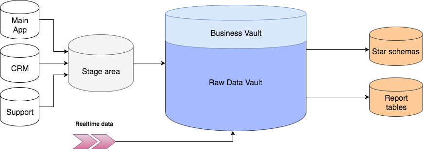
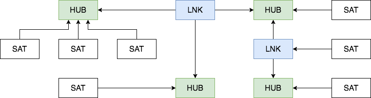
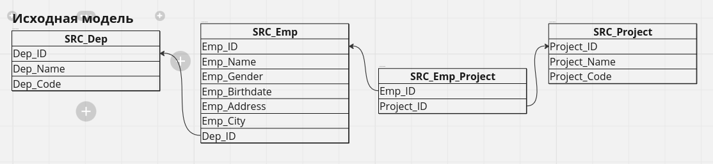
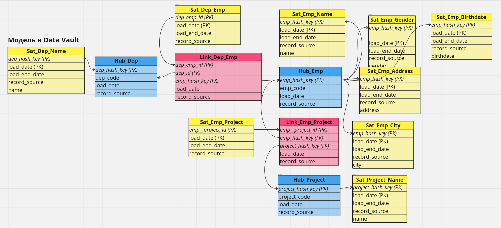
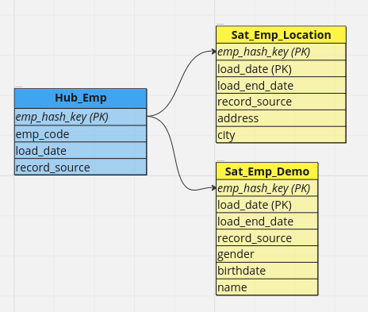
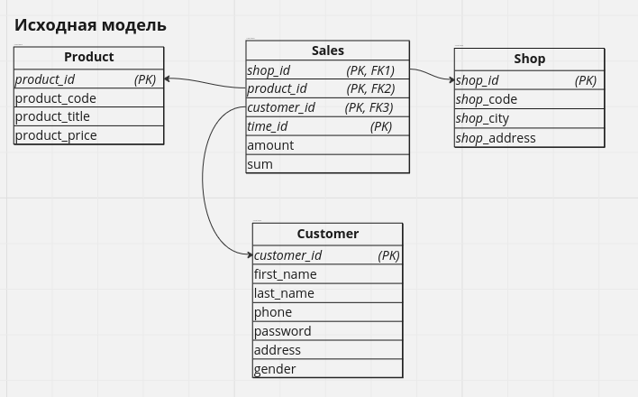
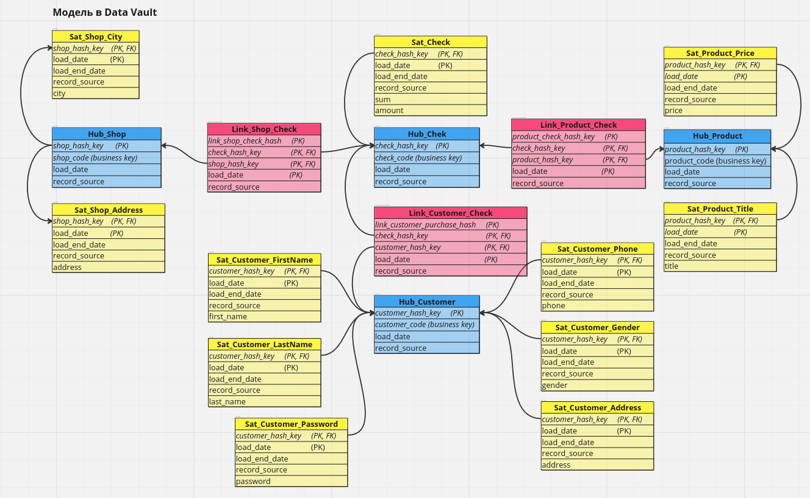
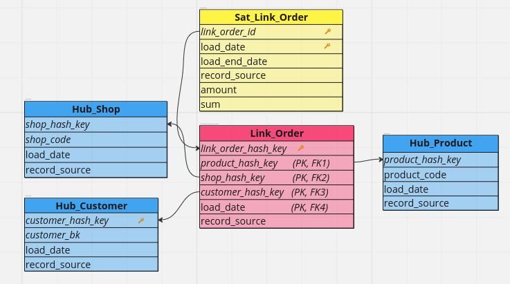
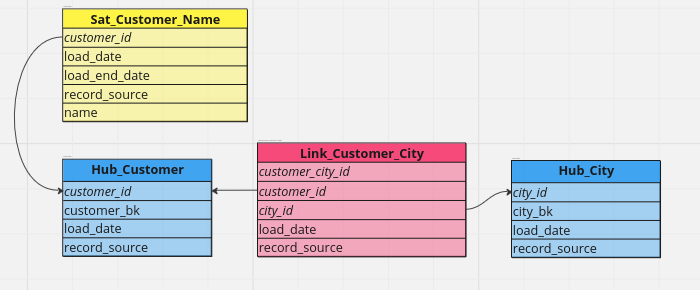
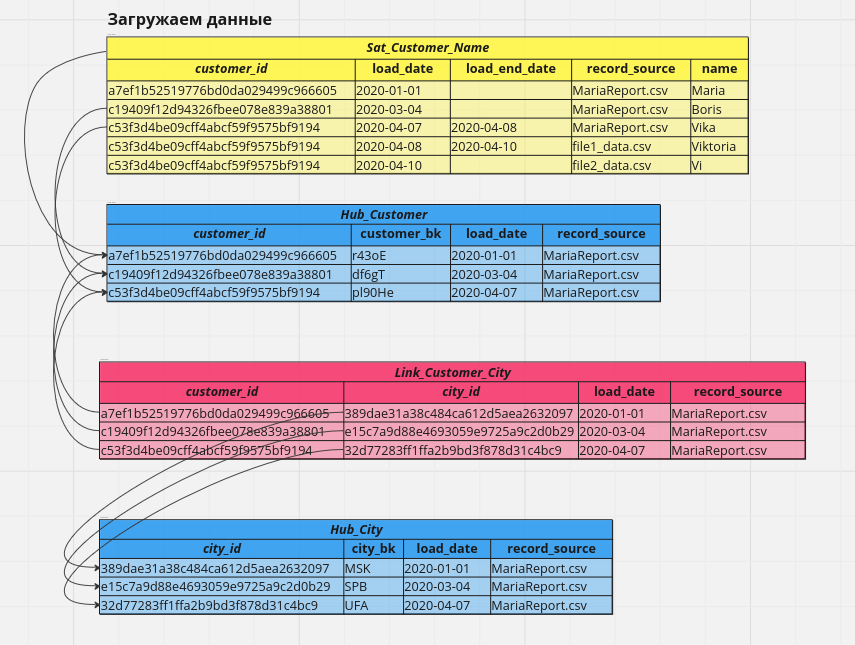

# Тестовый пример моделирования Data Vault   
### Структура DV   
   
   

### Пример №1   
   
   

**Сколько сателитов должно быть?**   
Можно разделить на 2 сателита по частоте обновления, при условии что все данные из одного источника, но если будет разделение в микросервисной архитектуре, и у какого-то атрибута изменится источник, тогда надо будет останавливать ETL процесс и выносить этот атрибут в отдельный сателит и пересобирать структуру, или если данные из разных источников будут лежать в одном сателете могут возникнуть вопросы, что делать если данные из одного источника пришли, а из другого пока нет, лучше  сделать 1 атрибут = 1 сателит как в якорной модели   
   

### Пример №2   

   
   

**Как идентифицировать линк?**   

   
Человек покупает товар   
Product: 1, Shop: 1, Customer: 2, Date: 2020-01-01, Sum: 200, Amount: 2   

А потом говорит, что передумал и нам прилетает такая строчка   
Product: 2, Shop: 1, Customer: 2, Date: 2020-01-01, Sum: 400, Amount: 1   
Как отлечить что это не новая продажа в этотже день тому же покупателю другого продукта. Получится что у одного покупателя будет две продажи в один день   

Если мы идентифицируем линк как набором ссылок, то изменение ссылки приводет к потере связи между этими ссылками. Как мы должны связать новую ссылку с предыдущей?   

### Пример №3   
Тестовые данные:   
Customer: r43oE, Name: Maria, City: MSK, TS: 2020-01-01   
Customer: df6gT, Name: Boris, City: UFA, TS: 2020-03-04   
Customer: pl90He, Name: Vika, City: SPB, TS: 2020-04-07   

Получаем хеш бизнес ключей для загрузки   
MD5(r43oE) a7ef1b52519776bd0da029499c966605   

Разбиваем входные данные:   
2 Хаба: Customer   
1 Сателит: Name   
1 Линк: Customer_City     

      
      
   

