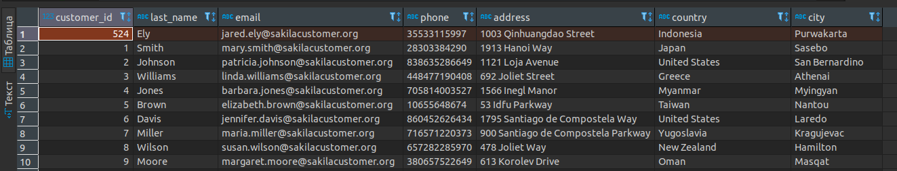
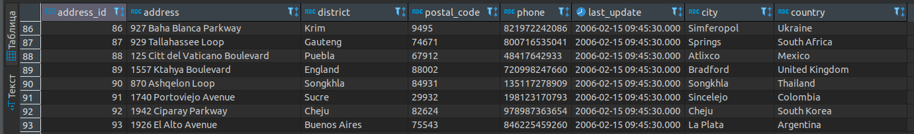
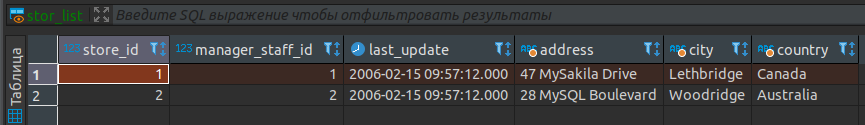
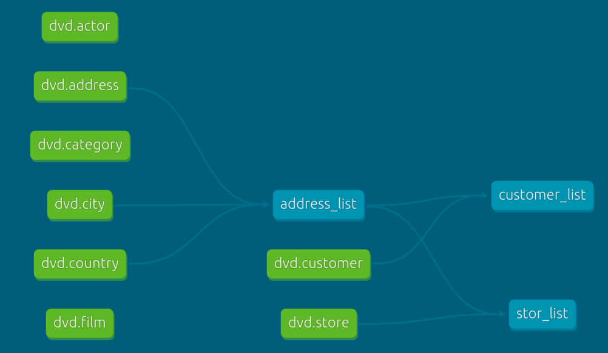
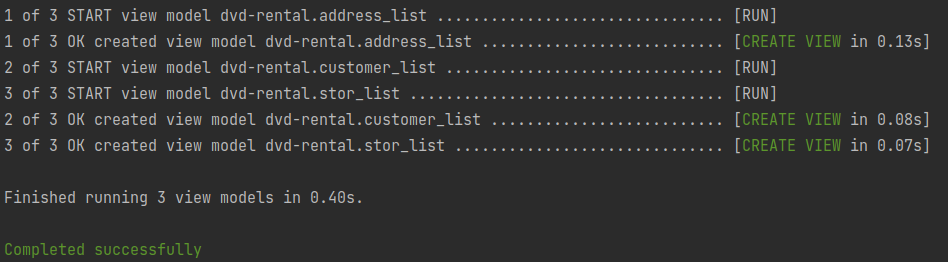

# Создание витрин и автоматизация с dbt

База данных “DVD проката” представляет бизнес-процессы магазина проката DVD.  

В базе данных “DVD проката” имеется 15 таблиц:  
**actor** — хранит данные об актёрах, включая их имя и фамилию.  
**film** — хранит данные о фильмах, включая их название, год выпуска, время, рейтинг и т.д.  
**film_actor** — хранит отношения между фильмами и актёрами.  
**category** — хранит данные о жанрах фильмов.  
**film_category** -хранит отношения между фильмами и жанрами.  
**store** — содержит данные магазина, включая данные о менеджере и адресе.  
**inventory** — хранит данные инвентаризации.  
**rental** — хранит данные об аренде.  
**payment** — хранит платежи клиента.  
**staff** — хранит данные персонала.  
**customer** — хранит данные покупателей.  
**address** — хранит адресные данные для сотрудников и клиентов.  
**city** — хранит названия городов.  
**country** — хранит названия стран.  

## ER-модель

Поднимаем контейнер с бд
~~~
docker run --name POG_DBT --rm -d -p 5555:5432 -e POSTGRES_PASSWORD=postgres -e POSTGRES_USER=postgres -e POSTGRES_DB=dvd -v pg_dbt:/var/lib/postgresql/data postgres
~~~

Делаем дамп из локальной базы
~~~
pg_dump -h 127.0.0.1 -p 5432 -U postgres -W -Fc -d postgres -f dvd.dump
~~~

Разворачиваем дамп в контейнер
~~~
pg_restore -h localhost -p 5555 -U postgres -W -d dvd dvd.dump 
~~~

Устанавливаем dbt и postgres адаптер
~~~
pip install dbt-postgres
~~~

Создаем dbt проект и проверяем настройки конфигов
~~~
dbt init dvd_r
export DBT_PROFILES_DIR=$(pwd)
dbt debug
~~~

## Создаем модели

### Список покупателей
~~~
SELECT
	c.customer_id
	,c.last_name
	,c.email
	,a.phone
	,a.address
	,a.country
	,a.city
	,c.create_date
	,c.last_update
	,c.active
FROM {{ source('dvd', 'customer') }} AS c
LEFT JOIN {{ ref('address_list') }} AS a ON a.address_id = c.address_id
~~~

### Список адресов
~~~
SELECT
	a.address_id
	,a.address
	,a.district
	,a.postal_code
	,a.phone
	,a.last_update
	,c2.city
	,c3.country
FROM {{ source('dvd', 'address')}} AS a
LEFT JOIN {{ source('dvd', 'city')}} AS c2 ON a.city_id = c2.city_id
LEFT JOIN {{ source('dvd', 'country')}} AS c3 ON c2.country_id = c3.country_id
~~~

### Список магазинов
~~~
SELECT
	s.store_id
	,s.manager_staff_id
	,s.last_update
	,a.address
	,a.city
	,a.country
FROM {{ source('dvd', 'store') }} AS s
LEFT JOIN {{ ref('address_list') }} AS a ON a.address_id = s.address_id
~~~

Раскатываем модели
~~~
dbt run 
~~~
### Покупатели  

### Адреса  

### Магазины

Создаем документацию для dbt проекта
~~~
dbt docs generate
~~~

## DAG зависимостей 
~~~
dbt docs serve &
~~~

### Если были правки можно удобно обновить все зависимости таблиц
~~~
dbt run -m address_list+
~~~

