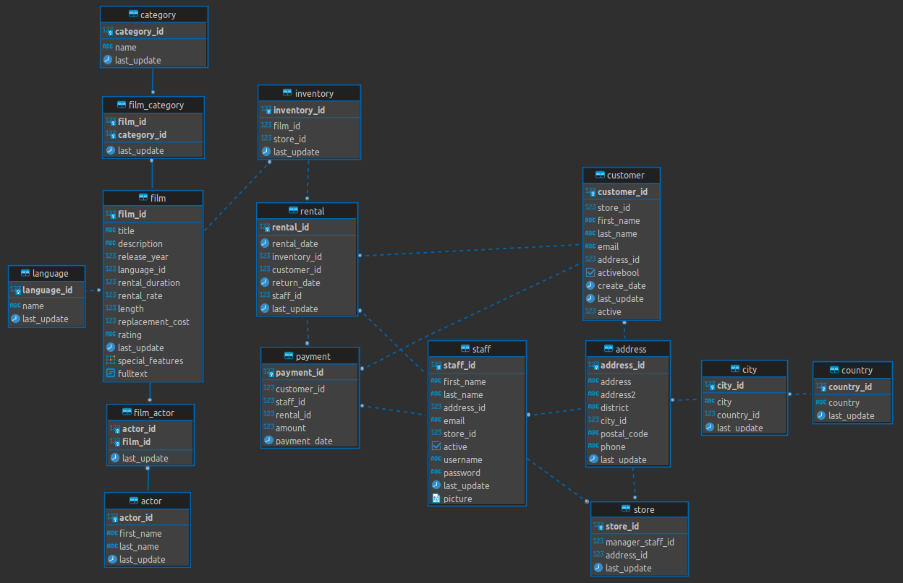
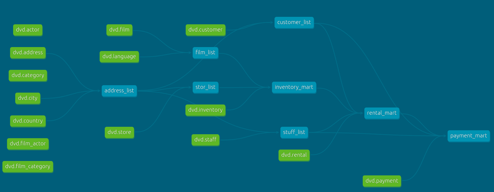
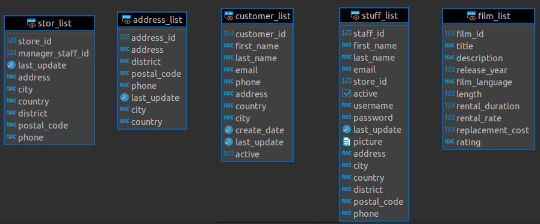
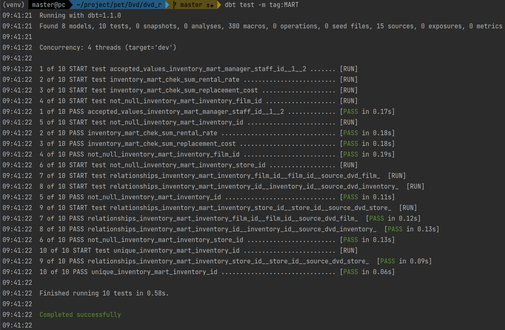

# Создание витрин и автоматизация с dbt

База данных “DVD проката” представляет бизнес-процессы магазина проката DVD.  

В базе данных “DVD проката” имеется 15 таблиц:  
**actor** — хранит данные об актёрах, включая их имя и фамилию.  
**film** — хранит данные о фильмах, включая их название, год выпуска, время, рейтинг и т.д.  
**film_actor** — хранит отношения между фильмами и актёрами.  
**category** — хранит данные о жанрах фильмов.  
**film_category** -хранит отношения между фильмами и жанрами.  
**store** — содержит данные магазина, включая данные о менеджере и адресе.  
**inventory** — хранит данные инвентаризации.  
**rental** — хранит данные об аренде.  
**payment** — хранит платежи клиента.  
**staff** — хранит данные персонала.  
**customer** — хранит данные покупателей.  
**address** — хранит адресные данные для сотрудников и клиентов.  
**city** — хранит названия городов.  
**country** — хранит названия стран.  

## ER-модель

## DAG зависимостей dbt

## Настройка проекта
**Поднимаем контейнер с бд**
~~~
docker run --name POG_DBT --rm -d -p 5555:5432 -e POSTGRES_PASSWORD=postgres -e POSTGRES_USER=postgres -e POSTGRES_DB=dvd -v pg_dbt:/var/lib/postgresql/data postgres
~~~

**Делаем дамп из локальной базы**
~~~
pg_dump -h 127.0.0.1 -p 5432 -U postgres -W -Fc -d postgres -f dvd.dump
~~~

**Разворачиваем дамп в контейнер**
~~~
pg_restore -h localhost -p 5555 -U postgres -W -d dvd dvd.dump 
~~~

**Устанавливаем dbt и postgres адаптер**
~~~
pip install dbt-postgres
~~~

**Добавляем настройки для адаптора в profiles.yml**
~~~
pg_conf:
  target: dev
  outputs:
    dev:
      type: postgres
      threads: 4
      host: localhost
      port: 5555
      user: postgres
      pass: postgres
      dbname: dvd
      schema: dvd-rental
~~~

**Создаем dbt проект и проверяем настройки конфигов**
~~~
dbt init dvd_r
export DBT_PROFILES_DIR=$(pwd)
dbt debug
~~~

**Дбавляем настройки проекта по моделям в dbt_project.yml**
~~~
models:
  dvd_r:
    main:
      +materialized: view
      +tags: VIEW
    marts:
      +materialized: incremental
      +schema: marts
      +tags: MART
~~~

**Добавляем источники в source.yml**
~~~
version: 2

sources:
  - name: 'dvd'
    database: dvd
    schema: dvd-rental
    tables:
      - name: actor
      - name: film
      - name: film_actor
      - name: category
      - name: film_category
      - name: store
      - name: inventory
      - name: rental
      - name: payment
      - name: staff
      - name: customer
      - name: address
      - name: city
      - name: country
      - name: language
~~~

## Создаем модели
**address_list**
~~~
SELECT
	a.address_id
	,a.address
	,a.district
	,a.postal_code
	,a.phone
	,a.last_update
	,c2.city
	,c3.country
FROM {{ source('dvd', 'address')}} AS a
LEFT JOIN {{ source('dvd', 'city')}} AS c2 ON a.city_id = c2.city_id
LEFT JOIN {{ source('dvd', 'country')}} AS c3 ON c2.country_id = c3.country_i
~~~
  
**customer_list**
~~~
SELECT
	c.customer_id
	,c.first_name
	,c.last_name
	,c.email
	,a.phone
	,a.address
	,a.country
	,a.city
	,c.create_date
	,c.last_update
	,c.active
FROM {{ source('dvd', 'customer') }} AS c
LEFT JOIN {{ ref('address_list') }} AS a ON a.address_id = c.address_id
~~~

**film_list**
~~~
SELECT
	f.film_id
	,f.title
	,f.description
	,f.release_year
	,l."name" 				AS film_language
    ,f.length
	,f.rental_duration
	,f.rental_rate
    ,f.replacement_cost
	,f.rating
FROM {{ source('dvd', 'film') }} AS f
LEFT JOIN {{ source('dvd', 'language') }} AS l
    ON f.language_id = l.language_id
~~~
  
**stor_list**
~~~
SELECT
	s.store_id
	,s.manager_staff_id
	,s.last_update
	,a.address
	,a.city
	,a.country
	,a.district
	,a.postal_code
	,a.phone
FROM {{ source('dvd', 'store') }} AS s
LEFT JOIN {{ ref('address_list') }} AS a ON a.address_id = s.address_id
~~~

**stuff_list**
~~~
SELECT
    st.staff_id
    ,st.first_name
    ,st.last_name
    ,st.email
    ,st.store_id
    ,st.active
    ,st.username
    ,st.password
    ,st.last_update
    ,st.picture
    ,a.address
    ,a.city
    ,a.country
    ,a.district
    ,a.postal_code
    ,a.phone
FROM {{ source('dvd', 'staff') }} AS st
LEFT JOIN {{ ref('address_list') }} AS a ON st.address_id = a.address_id
~~~

**Раскатываем модели**
~~~
dbt run 
~~~

## Создаем витрины
**inventory_mart**
~~~
SELECT
    i.inventory_id
    ,i.film_id                          AS inventory_film_id
    ,i.store_id                         AS inventory_store_id
    ,i.last_update                      AS inventory_last_update
    ,f.film_id
    ,f.title
    ,f.description
    ,f.release_year
    ,f.film_language
    ,f.length
    ,f.rental_duration
    ,f.rental_rate
    ,f.replacement_cost
    ,f.rating
    ,s.store_id
    ,s.manager_staff_id
    ,s.last_update
    ,s.address
    ,s.city
    ,s.country
    ,s.district
    ,s.postal_code
    ,s.phone
FROM {{ source('dvd', 'inventory') }}   AS i
LEFT JOIN {{ ref('film_list') }}        AS f
    ON i.film_id = f.film_id
LEFT JOIN {{ ref('stor_list') }}        AS s
    ON i.store_id = s.store_id
~~~

**payment_mart**
~~~
SELECT
	p.payment_id                            AS payment_id
	,p.customer_id                          AS payment_customer_id
	,p.staff_id                             AS payment_staff_id
	,p.rental_id                            AS payment_rental_id
	,p.amount
	,p.payment_date
	,rm.rental_rental_id
	,rm.rental_inventory_id
	,rm.rental_customer_id
	,rm.rental_staff_id
	,rm.rental_date
	,rm.rental_return_date
	,rm.day_rent
	,rm.film_film_id
	,rm.film_title
	,rm.film_description
	,rm.film_release_year
	,rm.film_rental_duration
	,rm.film_rental_rate
	,rm.film_rent_for_day
	,rm.film_length
	,rm.film_replacement_cost
	,rm.film_rating
	,s.staff_id
	,s.first_name                           AS staff_first_name
	,s.last_name                            AS staff_last_name
	,s.email                                AS staff_email
	,s.store_id                             AS staff_store_id
	,s.active                               AS staff_active
	,s.username
	,s."password"
	,s.picture
	,s.address                              AS staff_address
	,s.city                                 AS staff_city
	,s.country                              AS staff_country
	,s.district
	,s.postal_code
	,s.phone                                AS staff_phone
	,cl.customer_id
	,cl.first_name
	,cl.last_name
	,cl.email
	,cl.phone
	,cl.address
	,cl.country
	,cl.city
	,cl.create_date
	,cl.last_update
	,cl.active
FROM {{ source('dvd', 'payment') }}         AS p
LEFT JOIN {{ ref('rental_mart') }}          AS rm
    ON p.rental_id = rm.rental_rental_id
LEFT JOIN {{ ref('stuff_list') }}           AS s
    ON p.staff_id = s.staff_id
LEFT JOIN {{ ref('customer_list') }}        AS cl
    ON p.customer_id = cl.customer_id
~~~

**rental_mart**
~~~
SELECT
	r.rental_id AS rental_rental_id
	,r.inventory_id AS rental_inventory_id
	,r.customer_id AS rental_customer_id
	,r.staff_id AS rental_staff_id
	,r.rental_date AS rental_date
	,r.return_date AS rental_return_date
	,EXTRACT(DAY FROM (r.return_date - r.rental_date)) AS day_rent
	,i.store_id AS stor_store_id
	,i.address AS stor_address
	,i.city AS stor_city
	,i.country AS stor_country
	,i.manager_staff_id AS stor_manager_staff_id
	,i.film_id AS film_film_id
	,i.title AS film_title
	,i.description AS film_description
	,i.release_year AS film_release_year
	,i.rental_duration AS film_rental_duration
	,i.rental_rate AS film_rental_rate
	,round(i.rental_rate / i.rental_duration, 3) AS film_rent_for_day
	,i.length AS film_length
	,i.replacement_cost AS film_replacement_cost
	,i.rating AS film_rating
	,cl.customer_id AS customer_customer_id
	,cl.first_name AS customer_first_name
	,cl.last_name AS customer_last_name
	,cl.email AS customer_email
	,cl.phone AS customer_phone
	,cl.address AS customer_address
	,cl.country AS customer_country
	,cl.city AS customer_city
	,sl2.staff_id AS stuff_staff_id
	,sl2.first_name AS stuff_first_name
	,sl2.last_name AS stuff_last_name
	,sl2.address AS stuff_address
	,sl2.city AS stuff_city
	,sl2.country AS stuff_country
	,sl2.email AS stuff_email
	,sl2.username AS stuff_user_name
	,sl2."password" AS stuff_password
	,sl2.active	AS stuff_active
	,sl2.picture AS stuff_picture
FROM {{ source('dvd', 'rental') }} AS r
LEFT JOIN {{ ref('inventory_mart') }} AS i
	ON r.inventory_id = i.inventory_id
LEFT JOIN {{ ref('customer_list') }}  AS cl
	ON r.customer_id = cl.customer_id
LEFT JOIN {{ ref('stuff_list') }} AS sl2
	ON r.staff_id = sl2.staff_id
~~~

## Добавляем тесты

Для примера тесты будут только на 1 витрине **inventory_mart** проверим сылочную целостность, уникальность и значения сумм

**Общие тесты**
~~~
version: 2

models:
  - name: inventory_mart
    columns:
      - name: inventory_id
        tests:
          - unique
          - not_null
          - relationships:
              to: source('dvd', 'inventory')
              field: inventory_id

      - name: inventory_film_id
        tests:
          - not_null
          - relationships:
              to: source('dvd', 'film')
              field: film_id

      - name: inventory_store_id
        tests:
          - not_null
          - relationships:
              to: source('dvd', 'store')
              field: store_id

      - name: manager_staff_id
        tests:
          - accepted_values:
              values: [1, 2]
~~~

**Добавляем тесты на проверку сумм**
~~~
SELECT
	*
FROM {{ ref('inventory_mart') }} AS im
WHERE im.rental_rate < 0
~~~
~~~
SELECT
	*
FROM {{ ref('inventory_mart') }} AS im
WHERE im.replacement_cost < 0
~~~

**Раскатываем все тесты с тегом витрин**  
~~~
dbt test -m tag:MART
~~~

