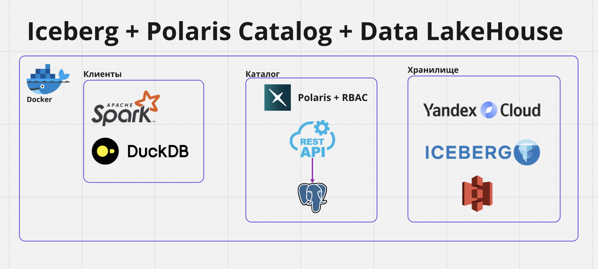
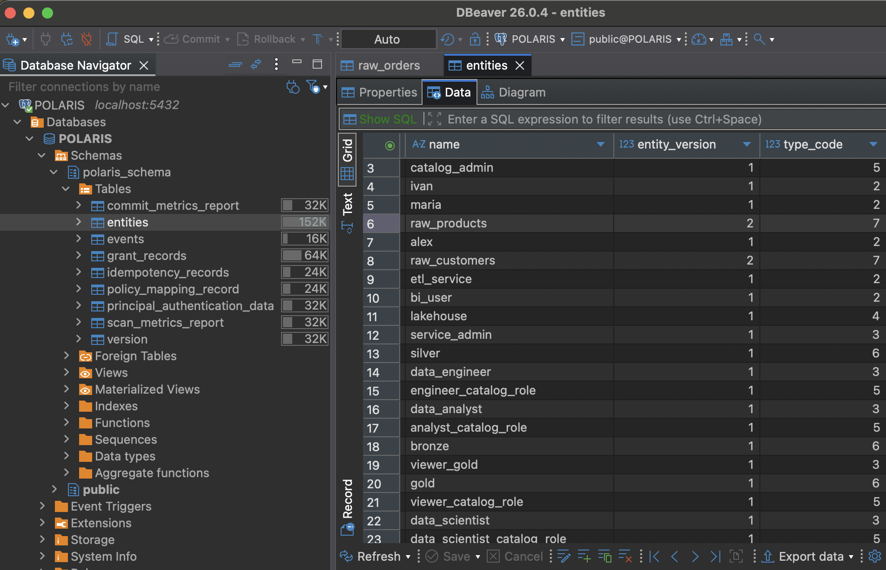
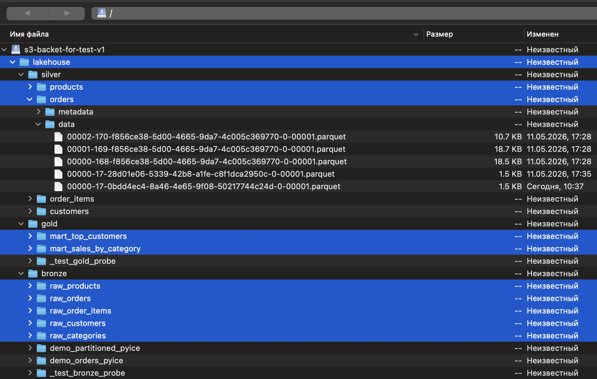
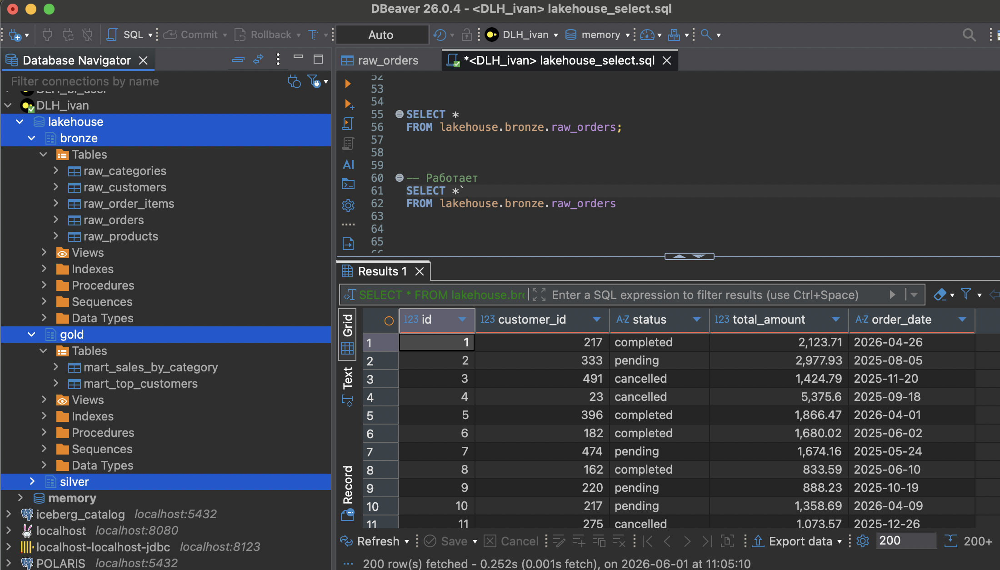
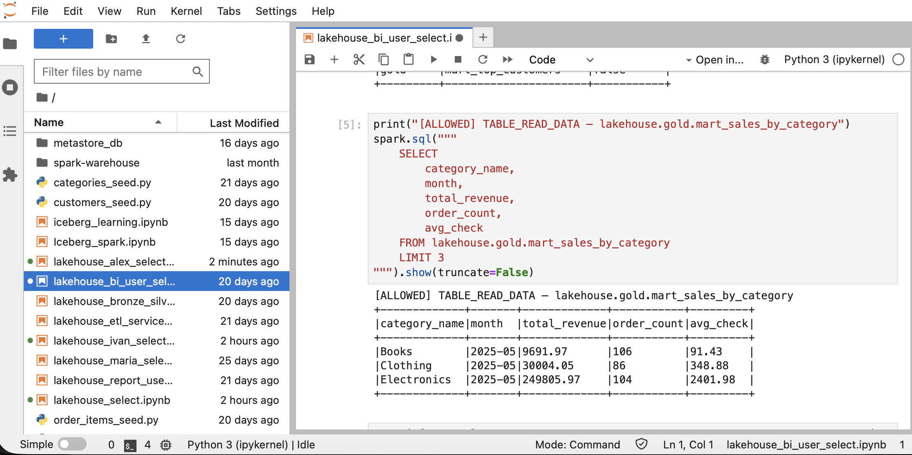

# Apache Iceberg + Apache Polaris Catalog + Data LakeHouse

## Заметки:   
- Это тестовый стенд не предназначен для запуска, так как не расписан полный алгоритм, но могут быть полезны отдельные модули, блоки кода или логика.   
- Использовал ИИ для ускорения работы, фокус был на обучение, понимание технологий и тесты.

## DataLakeHouse:
- Табличный формат Iceberg
- 3 слоя bronze, silver, gold
- Таблицы и витрины
~~~
"""
╔══════════════════════════════════════════════════════════════╗
║           DATA LAKEHOUSE — ПОЛНАЯ СТРУКТУРА СТЕНДА           ║
╚══════════════════════════════════════════════════════════════╝

━━━━━━━━━━━━━━━━━━━━━━━━━━━━━━━━━━━━━━━━━━━━━━━━━━━━━━━━━━━━━
ХРАНИЛИЩЕ — Yandex Object Storage
━━━━━━━━━━━━━━━━━━━━━━━━━━━━━━━━━━━━━━━━━━━━━━━━━━━━━━━━━━━━━
s3://my-bucket/
└── lakehouse/
  ├── bronze/
  ├── silver/
  └── gold/

━━━━━━━━━━━━━━━━━━━━━━━━━━━━━━━━━━━━━━━━━━━━━━━━━━━━━━━━━━━━━
КАТАЛОГ — Apache Polaris
━━━━━━━━━━━━━━━━━━━━━━━━━━━━━━━━━━━━━━━━━━━━━━━━━━━━━━━━━━━━━
catalog: lakehouse
│   storage_location: s3://my-bucket/lakehouse/
│
├── namespace: bronze
│   ├── raw_categories      (5 строк — справочник категорий)
│   ├── raw_products        (100 строк — 5% null, 10% inactive)
│   ├── raw_customers       (1 030 строк — с дублями)
│   ├── raw_orders          (20 000 строк — 2% невалидных статусов)
│   └── raw_order_items     (60 041 строка)
│
├── namespace: silver
│   ├── customers           (1 000 строк — дедупликация)
│   ├── products            (81 строка — только активные)
│   ├── orders              (19 608 строк — только валидные)
│   └── order_items         (60 041 строка — с line_total)
│
└── namespace: gold
  ├── mart_sales_by_category  (65 строк — выручка по категориям)
  └── mart_top_customers      (1 000 строк — RFM High/Mid/Low)

━━━━━━━━━━━━━━━━━━━━━━━━━━━━━━━━━━━━━━━━━━━━━━━━━━━━━━━━━━━━━
PRINCIPALS
━━━━━━━━━━━━━━━━━━━━━━━━━━━━━━━━━━━━━━━━━━━━━━━━━━━━━━━━━━━━━
├── ivan        (USER)    → data_engineer
├── maria       (USER)    → data_analyst
├── alex        (USER)    → data_scientist
├── etl_service (USER)    → etl_service
└── bi_user     (USER)    → viewer_gold

━━━━━━━━━━━━━━━━━━━━━━━━━━━━━━━━━━━━━━━━━━━━━━━━━━━━━━━━━━━━━
PRINCIPAL ROLES
━━━━━━━━━━━━━━━━━━━━━━━━━━━━━━━━━━━━━━━━━━━━━━━━━━━━━━━━━━━━━
├── data_engineer  — полный контроль каталога, весь pipeline
├── data_analyst   — читает silver, читает и пишет gold
├── viewer_gold    — только чтение gold, для BI и бизнес-пользователей
├── data_scientist — читает все слои, ничего не пишет
└── etl_service    — пишет в bronze, читает bronze, пишет в silver

━━━━━━━━━━━━━━━━━━━━━━━━━━━━━━━━━━━━━━━━━━━━━━━━━━━━━━━━━━━━━
CATALOG ROLES И ПРИВИЛЕГИИ (catalog: lakehouse)
━━━━━━━━━━━━━━━━━━━━━━━━━━━━━━━━━━━━━━━━━━━━━━━━━━━━━━━━━━━━━
engineer_catalog_role
│   Может всё: создавать/удалять таблицы и неймспейсы, читать
│   и писать данные, управлять доступами других ролей.
│   Полный контроль каталога.
├── [catalog]    CATALOG_MANAGE_CONTENT
└── [catalog]    CATALOG_MANAGE_ACCESS

analyst_catalog_role
│   Читает чистые таблицы из silver для построения отчётов.
│   В gold — полные права: создаёт собственные витрины,
│   обновляет данные. Bronze закрыт — грязный слой до
│   трансформации.
├── [catalog]    NAMESPACE_LIST
├── [ns: silver] TABLE_LIST, TABLE_READ_DATA, TABLE_FULL_METADATA
└── [ns: gold]   TABLE_CREATE, TABLE_LIST, TABLE_READ_DATA,
               TABLE_WRITE_DATA, TABLE_FULL_METADATA

viewer_catalog_role
│   Только просмотр готовых витрин gold. Не может ничего
│   изменять или создавать. Подходит для BI-инструментов
│   и бизнес-пользователей.
├── [catalog]    NAMESPACE_LIST
└── [ns: gold]   TABLE_LIST, TABLE_READ_DATA, TABLE_FULL_METADATA

data_scientist_catalog_role
│   Читает данные из всех трёх слоёв. Ничего не пишет
│   и не создаёт. Нужен для разведочного анализа сырых
│   данных и подготовки датасетов для ML.
├── [catalog]    NAMESPACE_LIST
├── [ns: bronze] TABLE_LIST, TABLE_READ_DATA, TABLE_FULL_METADATA
├── [ns: silver] TABLE_LIST, TABLE_READ_DATA, TABLE_FULL_METADATA
└── [ns: gold]   TABLE_LIST, TABLE_READ_DATA, TABLE_FULL_METADATA

etl_service_catalog_role
│   Сервисный аккаунт для автоматизированных ETL-джобов
│   (Airflow, Spark). Пишет сырые данные в bronze, читает
│   bronze для трансформации, пишет результат в silver.
│   Gold не доступен — за витрины отвечает аналитик.
├── [catalog]    NAMESPACE_LIST
├── [ns: bronze] TABLE_CREATE, TABLE_LIST, TABLE_READ_DATA,
│               TABLE_WRITE_DATA, TABLE_FULL_METADATA
└── [ns: silver] TABLE_CREATE, TABLE_LIST, TABLE_READ_DATA,
               TABLE_WRITE_DATA, TABLE_FULL_METADATA

━━━━━━━━━━━━━━━━━━━━━━━━━━━━━━━━━━━━━━━━━━━━━━━━━━━━━━━━━━━━━
PRINCIPAL ROLE > CATALOG ROLE
━━━━━━━━━━━━━━━━━━━━━━━━━━━━━━━━━━━━━━━━━━━━━━━━━━━━━━━━━━━━━
├── data_engineer  → engineer_catalog_role
├── data_analyst   → analyst_catalog_role
├── viewer_gold    → viewer_catalog_role
├── data_scientist → data_scientist_catalog_role
└── etl_service    → etl_service_catalog_role

━━━━━━━━━━━━━━━━━━━━━━━━━━━━━━━━━━━━━━━━━━━━━━━━━━━━━━━━━━━━━
МАТРИЦА ДОСТУПОВ
━━━━━━━━━━━━━━━━━━━━━━━━━━━━━━━━━━━━━━━━━━━━━━━━━━━━━━━━━━━━━
namespace | data_engineer | data_analyst   | viewer_gold    | data_scientist | etl_service
----------|---------------|----------------|----------------|----------------|------------------
bronze    | полный доступ | нет доступа    | нет доступа    | только чтение  | чтение + запись
silver    | полный доступ | только чтение  | нет доступа    | только чтение  | чтение + запись
gold      | полный доступ | чтение + запись| только чтение  | только чтение  | нет доступа

━━━━━━━━━━━━━━━━━━━━━━━━━━━━━━━━━━━━━━━━━━━━━━━━━━━━━━━━━━━━━
ИТОГО
━━━━━━━━━━━━━━━━━━━━━━━━━━━━━━━━━━━━━━━━━━━━━━━━━━━━━━━━━━━━━
- 1 каталог:        lakehouse
- 3 namespace:      bronze, silver, gold
- 11 таблиц:        5 bronze + 4 silver + 2 gold
- 5 principals:     ivan, maria, alex, etl_service, bi_user
- 5 principal roles: data_engineer, data_analyst, viewer_gold, data_scientist, etl_service
- 5 catalog roles:  engineer_, analyst_, viewer_, data_scientist_, etl_service_catalog_role

"""
~~~

## Polaris REST Catalog + RBAC:   
- Роли, права, каталог scripts/config_rbac_one_catalog.py
- Модуль для администрирования каталога polaris_client 

Polaris metadb
   
~~~
polaris_client - Python клиент для Apache Polaris 1.4.0.
Модуль администрирует Polaris без UI: Catalog, RBAC, grants и Iceberg REST.

## Для чего нужен
- Управлять каталогами Polaris через Management API.
- Настраивать RBAC: users, roles, grants и связи между ними.
- Работать с namespaces, tables и views через Catalog API.
- Использовать один общий объект сессии с OAuth2 Bearer token.
- Проверять операции через интеграционный тест.

## Что умеет Management API
- Catalogs: list, get, create, update, delete.
- Principals: list, get, create, update, delete, rotate/reset credentials.
- Principal Roles: list, get, create, update, delete, assign/unassign.
- Catalog Roles: list, get, create, update, delete, assign/unassign.
- Grants: list, add, revoke на уровнях catalog, namespace, table и view.

## Что умеет Catalog API
- Config: получить конфигурацию каталога.
- Namespaces: list, create, get, exists, update properties, drop.
- Tables: list, create, get metadata, commit, exists, register, rename, drop.
- Views: list, create, get, update, exists, rename, drop.

~~~

## Визуализация и аналитические запросы:   
- DuckDB Визуализация через DBeaver и аналитические запросы
- Cyberduck просмотр S3
   
   

## Клиент для выполнения запросов:   
- Spark + Jupyter Notebook    
~~~
Ноутбуки для загрузки данных и проверки ролей RBAC
[lakehouse_alex_select.ipynb](spark/notebooks/lakehouse_alex_select.ipynb)
[lakehouse_bi_user_select.ipynb](spark/notebooks/lakehouse_bi_user_select.ipynb)
[lakehouse_bronze_silver_gold.ipynb](spark/notebooks/lakehouse_bronze_silver_gold.ipynb)
[lakehouse_etl_service_select.ipynb](spark/notebooks/lakehouse_etl_service_select.ipynb)
[lakehouse_ivan_select.ipynb](spark/notebooks/lakehouse_ivan_select.ipynb)
[lakehouse_maria_select.ipynb](spark/notebooks/lakehouse_maria_select.ipynb)
[lakehouse_report_user_select.ipynb](spark/notebooks/lakehouse_report_user_select.ipynb)
[lakehouse_select.ipynb](spark/notebooks/lakehouse_select.ipynb)

Например если запустить lakehouse_alex_select.ipynb тогда можно посмотреть как работает RBAC и уровни доступов к данным 

Где нет доступа будут ошибки типа:
[FORBIDDEN] INSERT в gold.mart_top_customers (read-only)
[ОЖИДАЕМО] Доступ запрещён: An error occurred while calling o43.sql.
: org.apache.iceberg.exceptions.ForbiddenException: Forbidden: Principal 'alex' with activated PrincipalRoles '[data_scientist]' and activated grants via '[data_scientist_catalog_role, data_scientist]' is not authorized for op ADD_TABLE_SNAPSHOT
	at org.apache.iceberg.rest.ErrorHandlers$DefaultErrorHandler.accept(ErrorHandlers.java:238)

~~~

