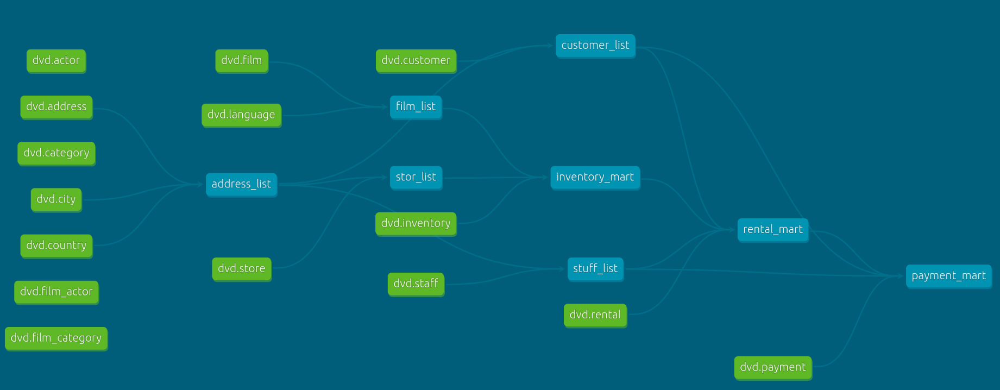
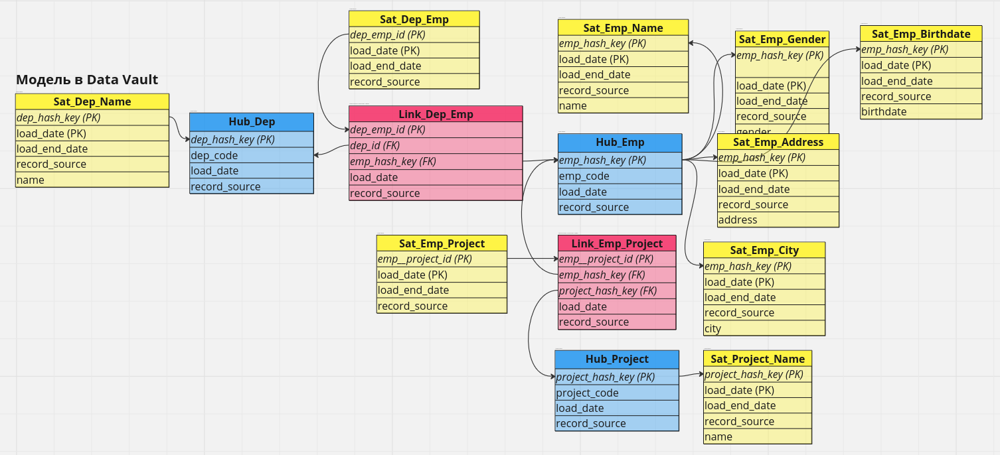
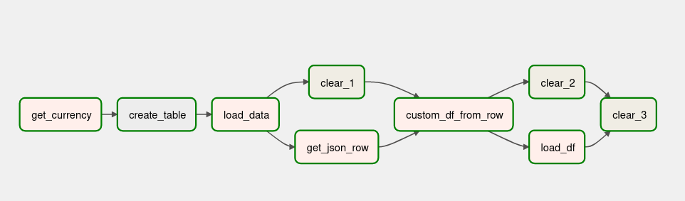

## Kubernetes Airflow Helm с ArgoCd
**Кастомный Airflow поднятый через Helm c GitSync и CD через ArgoCD**
https://github.com/master1521/pet/tree/master/Airflow_Helm

## K8S + Minikube + Nginx Helm + ArgoCd
**Стенд для изучения K8S + Minikube + Helm + ArgoCd**   
https://github.com/master1521/pet/tree/master/nginx-gitops    

## Spark Standalone кластер
**Локальный распределенный Spark класткер в режиме Standalone для тестов и обучения**   
https://github.com/master1521/pet/tree/master/Spark    

## Apache Iceberg
**Настройка локальной среды Data LakeHouse для изучения работы с iceberg**   
https://github.com/master1521/pet/tree/master/SparkIcebergJupyter    

## DBT
**Создание витрин и автоматизация с dbt**  
https://github.com/master1521/pet/tree/master/Dvd    

## GitLab CI/CD
**Gitlab CI/CD with Airflow**   
https://github.com/master1521/pet/tree/master/GitLab_CI_CD   

## Data Vault   
**Моделирование по Data Vault**   
https://github.com/master1521/pet/tree/master/DataVault    

## Моделирование
**Проектирование и наполнение базы для магазина книг (снежинка, звезда)**  
https://github.com/master1521/pet/tree/master/book    

## Telegram bot
**Telegram бот для загрузки музыки c youtube**   
https://github.com/master1521/pet/tree/master/TgYouTube   

## Airflow
**Pipeline ETL по курсу валют**  
https://github.com/master1521/pet/tree/master/Airflow   

**Pipeline ELT currency**  
https://github.com/master1521/pet/tree/master/Airflow_2    

## SQL  
**Авиаперевозки по РФ**  
https://github.com/master1521/pet/blob/master/avia/sql_air_transportation.pdf  

## Docker +pandas + jupyter notebook  
**Прокат фильмов**  
https://github.com/master1521/pet/blob/master/Film/film.ipynb  

## Парсинг сайта  
https://github.com/master1521/pet/blob/master/Scraping/game.py  

## Python  
**Банковский аккаунт**  
https://github.com/master1521/pet/blob/master/Bank%20Account/BankAccount.py  

