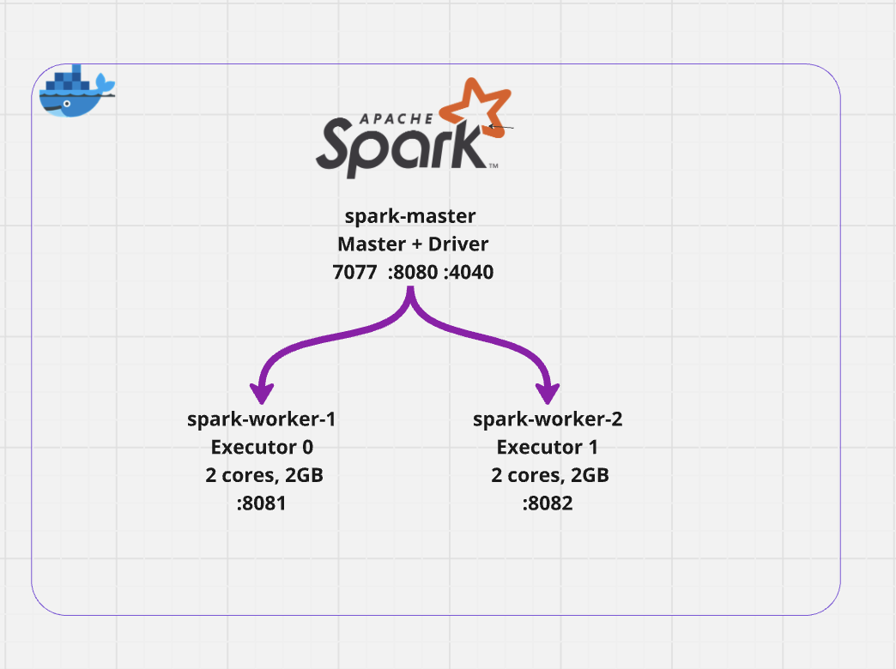
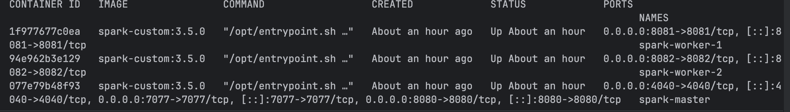
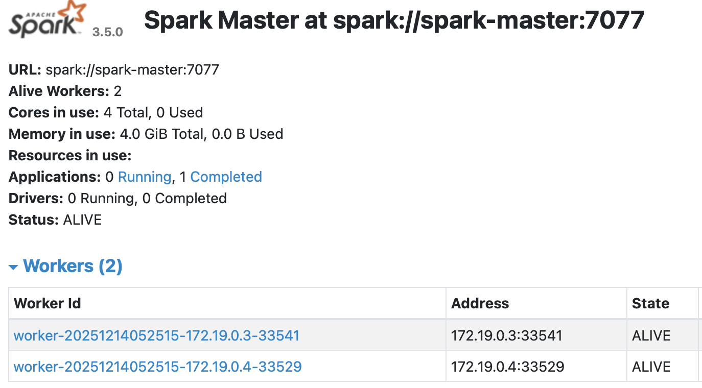
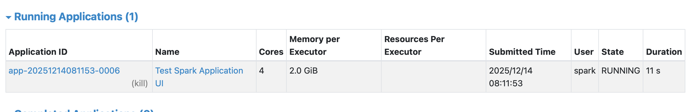
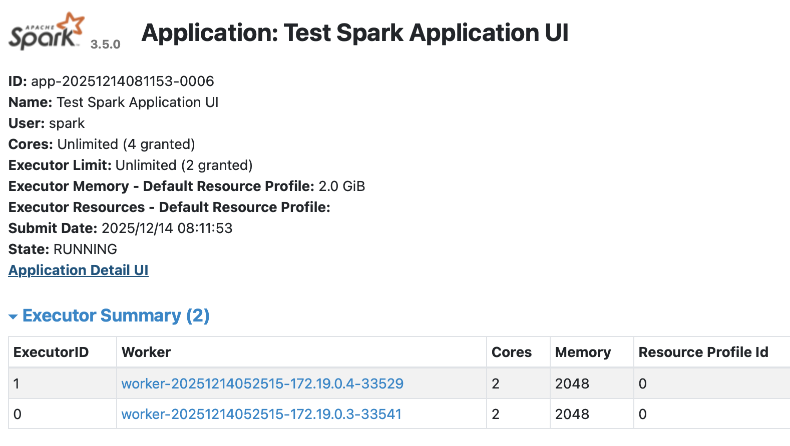
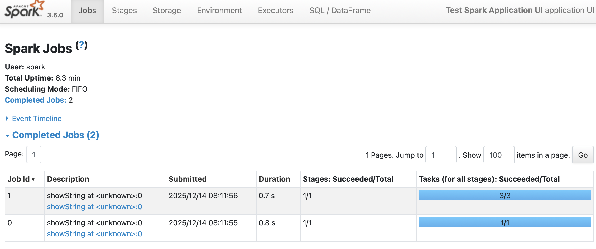
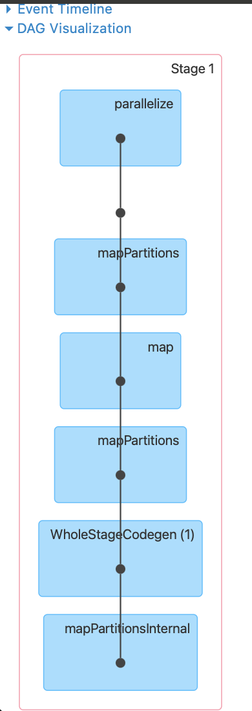
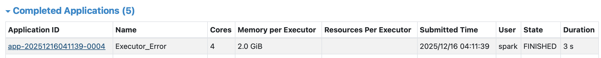
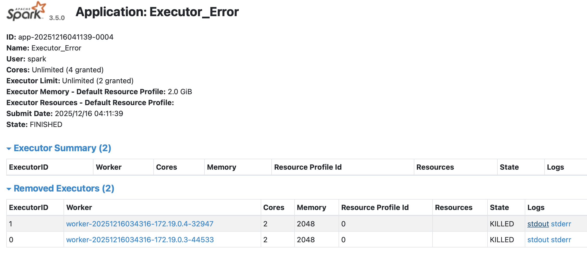

# Spark Standalone кластер   



## Содержание   
Проект представляет локальный распределенный Spark класткер в режиме Standalone для тестов и обучения.        
Cостоит из 1-ой мастер ноды (spark-master) и 2-х воркеров (spark-worker-1, spark-worker-2).   

- Standalone
- Компоненты Spark Standalone кластера
  - spark-master
  - spark-worker-1, spark-worker-2]
  - Driver
  - Executors
- Запуск
- Разбор логов запуска
  - Этапы запуска приложения
  - Доп заметки
- Spark Application UI
- Ошибки
  - Пример 1
  - Пример 2
- Shuffle


# Standalone   
Режим развертывания Spark, где кластер управляется собственным менеджером ресурсов Spark без внешних систем оркестрации (YARN, Kubernetes).      
Реальный кластер с сетевым взаимодействием, как на проде, в отличие от Local mode, где все в одном JVM процессе, и нет распределения.

### Подходит для:
- Локальной разработки, тестирования, обучения.
- Небольшие продовые кластеры — 10-50 нод с фиксированной нагрузкой.
- Простая инфраструктура — не нужны Hadoop, Kubernetes, сложная оркестрация.
- Batch обработка — регулярные ETL задачи по расписанию через Airflow/cron.


# Компоненты Spark Standalone кластера
~~~
Spark Application - Само приложение которое состоит из driver и executors
Spark Driver - Преобразует пользовательское приложение на задачи и распределяет по действующим исполнителям.
Spark Exexutors - это рабочие процессы, которые отвечают за выполнение задач, приходящих из драйвера.
Spark Session - Инициализация программы Spark, создание распределенной системы для будующих вычеслений
Cluster Manager - Менеджер ресурсов (YARN, Mesos)
Job - Задача в графе
DAG - Ациклический граф
Stage - Этап вычислений на который разбивается job
Task - Конкретный кусок работы, который будет выполняться на Executer
~~~

## spark-master
- Координатор кластера и точка подключения для приложений    
- Управляет регистрацией воркеров    
- Распределяет задачи между воркерами через Scheduler   
- Мониторит состояние воркеров   
- Не выполняет вычисления, только управление 
- Порты: 7077 (API), 8080 (Web UI), 4040 (Application UI)

## spark-worker-1, spark-worker-2
- Рабочие ноды для выполнения задач.   
- Регистрируются на мастере при запуске   
- Запускают Executor процессы по команде мастера   
- Выполняют tasks (вычисления, чтение/запись данных)   

## Driver (запускается на spark-master)
- Управляющий процесс Spark приложения, запускается на spark-master при вызове spark-submit или создании SparkSession.
- Создает SparkContext и SparkSession
- Преобразует код в DAG (направленный ациклический граф задач)
- Разбивает DAG на stages и tasks
- Отправляет tasks на executors через Cluster Manager
- Собирает результаты от executors

## Executors
- Запускаются на воркерах.   
- Процессы выполнения задач на воркерах.
- Выполняют tasks отправленные драйвером
- Возвращают результаты драйверу
- Общаются с драйвером через RPC


# Запуск
~~~
docker compose up -d
~~~
   

Проверяем подключеные воркеры, статус и ресурсы    
**Master UI http://localhost:8080**  
**Spark Worker 1 http://localhost:8081**    
**Spark Worker 2 http://localhost:8082**   
   

В проекте есть файл для первого запуска **apps/test_spark.py** запускаем его   
**Вариант 1: Запустить приложение с локалки**     
~~~
docker exec -it spark-master /opt/spark/bin/spark-submit \
  --master spark://spark-master:7077 \
  /opt/spark/apps/test_spark.py
~~~

**Вариант 2: Зайти в контейнер и запусить spark-submit**     
~~~
docker exec -it spark-master bash
/opt/spark/bin/spark-submit \
  --master spark://spark-master:7077 \
  /opt/spark/apps/test_spark.py
~~~


В терминале будут видны логи запуска и работы Spark приложения, и вывод тестовых данных, значит все работает как надо   
~~~
25/12/14 07:02:05 INFO DAGScheduler: Job 1 finished: showString at <unknown>:0, took 0.596328 s
25/12/14 07:02:06 INFO CodeGenerator: Code generated in 6.367 ms
+-------+---+
|   name|age|
+-------+---+
|  Alice| 34|
|    Bob| 45|
|Charlie| 28|
+-------+---+
25/12/14 07:02:06 INFO SparkContext: SparkContext is stopping with exitCode 0.
25/12/14 07:02:06 INFO SparkUI: Stopped Spark web UI at http://spark-master:4040
~~~

# Разбор логов запуска 
~~~
docker exec -it spark-master /opt/spark/bin/spark-submit \
  --master spark://spark-master:7077 \
  /opt/spark/apps/test_spark.py
25/12/14 07:02:02 INFO SparkContext: Running Spark version 3.5.0
25/12/14 07:02:02 INFO SparkContext: OS info Linux, 6.10.14-linuxkit, aarch64
25/12/14 07:02:02 INFO SparkContext: Java version 11.0.20.1
25/12/14 07:02:02 WARN NativeCodeLoader: Unable to load native-hadoop library for your platform... using builtin-java classes where applicable
25/12/14 07:02:02 INFO ResourceUtils: ==============================================================
25/12/14 07:02:02 INFO ResourceUtils: No custom resources configured for spark.driver.
25/12/14 07:02:02 INFO ResourceUtils: ==============================================================
25/12/14 07:02:02 INFO SparkContext: Submitted application: TestApp
25/12/14 07:02:02 INFO ResourceProfile: Default ResourceProfile created, executor resources: Map(cores -> name: cores, amount: 2, script: , vendor: , memory -> name: memory, amount: 2048, script: , vendor: , offHeap -> name: offHeap, amount: 0, script: , vendor: ), task resources: Map(cpus -> name: cpus, amount: 1.0)
25/12/14 07:02:02 INFO ResourceProfile: Limiting resource is cpus at 2 tasks per executor
25/12/14 07:02:02 INFO ResourceProfileManager: Added ResourceProfile id: 0
25/12/14 07:02:02 INFO SecurityManager: Changing view acls to: spark
25/12/14 07:02:02 INFO SecurityManager: Changing modify acls to: spark
25/12/14 07:02:02 INFO SecurityManager: Changing view acls groups to: 
25/12/14 07:02:02 INFO SecurityManager: Changing modify acls groups to: 
25/12/14 07:02:02 INFO SecurityManager: SecurityManager: authentication disabled; ui acls disabled; users with view permissions: spark; groups with view permissions: EMPTY; users with modify permissions: spark; groups with modify permissions: EMPTY
25/12/14 07:02:02 INFO Utils: Successfully started service 'sparkDriver' on port 44879.
25/12/14 07:02:02 INFO SparkEnv: Registering MapOutputTracker
25/12/14 07:02:02 INFO SparkEnv: Registering BlockManagerMaster
25/12/14 07:02:02 INFO BlockManagerMasterEndpoint: Using org.apache.spark.storage.DefaultTopologyMapper for getting topology information
25/12/14 07:02:02 INFO BlockManagerMasterEndpoint: BlockManagerMasterEndpoint up
25/12/14 07:02:02 INFO SparkEnv: Registering BlockManagerMasterHeartbeat
25/12/14 07:02:02 INFO DiskBlockManager: Created local directory at /tmp/spark-local/blockmgr-36e7f958-400f-47a5-b58b-3aa255a8c0c1
25/12/14 07:02:02 INFO MemoryStore: MemoryStore started with capacity 1048.8 MiB
25/12/14 07:02:02 INFO SparkEnv: Registering OutputCommitCoordinator
25/12/14 07:02:02 INFO JettyUtils: Start Jetty 0.0.0.0:4040 for SparkUI
25/12/14 07:02:02 INFO Utils: Successfully started service 'SparkUI' on port 4040.
25/12/14 07:02:02 INFO StandaloneAppClient$ClientEndpoint: Connecting to master spark://spark-master:7077...
25/12/14 07:02:02 INFO TransportClientFactory: Successfully created connection to spark-master/172.19.0.2:7077 after 9 ms (0 ms spent in bootstraps)
25/12/14 07:02:02 INFO StandaloneSchedulerBackend: Connected to Spark cluster with app ID app-20251214070202-0001
25/12/14 07:02:02 INFO StandaloneAppClient$ClientEndpoint: Executor added: app-20251214070202-0001/0 on worker-20251214052515-172.19.0.3-33541 (172.19.0.3:33541) with 2 core(s)
25/12/14 07:02:02 INFO StandaloneSchedulerBackend: Granted executor ID app-20251214070202-0001/0 on hostPort 172.19.0.3:33541 with 2 core(s), 2.0 GiB RAM
25/12/14 07:02:02 INFO StandaloneAppClient$ClientEndpoint: Executor added: app-20251214070202-0001/1 on worker-20251214052515-172.19.0.4-33529 (172.19.0.4:33529) with 2 core(s)
25/12/14 07:02:02 INFO StandaloneSchedulerBackend: Granted executor ID app-20251214070202-0001/1 on hostPort 172.19.0.4:33529 with 2 core(s), 2.0 GiB RAM
25/12/14 07:02:02 INFO Utils: Successfully started service 'org.apache.spark.network.netty.NettyBlockTransferService' on port 38883.
25/12/14 07:02:02 INFO NettyBlockTransferService: Server created on spark-master:38883
25/12/14 07:02:02 INFO BlockManager: Using org.apache.spark.storage.RandomBlockReplicationPolicy for block replication policy
25/12/14 07:02:02 INFO BlockManagerMaster: Registering BlockManager BlockManagerId(driver, spark-master, 38883, None)
25/12/14 07:02:02 INFO BlockManagerMasterEndpoint: Registering block manager spark-master:38883 with 1048.8 MiB RAM, BlockManagerId(driver, spark-master, 38883, None)
25/12/14 07:02:02 INFO BlockManagerMaster: Registered BlockManager BlockManagerId(driver, spark-master, 38883, None)
25/12/14 07:02:02 INFO BlockManager: Initialized BlockManager: BlockManagerId(driver, spark-master, 38883, None)
25/12/14 07:02:02 INFO StandaloneAppClient$ClientEndpoint: Executor updated: app-20251214070202-0001/0 is now RUNNING
25/12/14 07:02:02 INFO StandaloneAppClient$ClientEndpoint: Executor updated: app-20251214070202-0001/1 is now RUNNING
25/12/14 07:02:03 INFO StandaloneSchedulerBackend: SchedulerBackend is ready for scheduling beginning after reached minRegisteredResourcesRatio: 0.0
25/12/14 07:02:03 INFO SharedState: Setting hive.metastore.warehouse.dir ('null') to the value of spark.sql.warehouse.dir.
25/12/14 07:02:03 INFO SharedState: Warehouse path is 'file:/opt/spark/spark-warehouse'.
25/12/14 07:02:04 INFO StandaloneSchedulerBackend$StandaloneDriverEndpoint: Registered executor NettyRpcEndpointRef(spark-client://Executor) (172.19.0.3:39718) with ID 0,  ResourceProfileId 0
25/12/14 07:02:04 INFO StandaloneSchedulerBackend$StandaloneDriverEndpoint: Registered executor NettyRpcEndpointRef(spark-client://Executor) (172.19.0.4:56642) with ID 1,  ResourceProfileId 0
25/12/14 07:02:04 INFO BlockManagerMasterEndpoint: Registering block manager 172.19.0.3:36545 with 1048.8 MiB RAM, BlockManagerId(0, 172.19.0.3, 36545, None)
25/12/14 07:02:04 INFO BlockManagerMasterEndpoint: Registering block manager 172.19.0.4:37225 with 1048.8 MiB RAM, BlockManagerId(1, 172.19.0.4, 37225, None)
25/12/14 07:02:04 INFO CodeGenerator: Code generated in 68.613833 ms
25/12/14 07:02:04 INFO SparkContext: Starting job: showString at <unknown>:0
25/12/14 07:02:04 INFO DAGScheduler: Got job 0 (showString at <unknown>:0) with 1 output partitions
25/12/14 07:02:04 INFO DAGScheduler: Final stage: ResultStage 0 (showString at <unknown>:0)
25/12/14 07:02:04 INFO DAGScheduler: Parents of final stage: List()
25/12/14 07:02:04 INFO DAGScheduler: Missing parents: List()
25/12/14 07:02:04 INFO DAGScheduler: Submitting ResultStage 0 (MapPartitionsRDD[6] at showString at <unknown>:0), which has no missing parents
25/12/14 07:02:04 INFO MemoryStore: Block broadcast_0 stored as values in memory (estimated size 12.6 KiB, free 1048.8 MiB)
25/12/14 07:02:04 INFO MemoryStore: Block broadcast_0_piece0 stored as bytes in memory (estimated size 7.2 KiB, free 1048.8 MiB)
25/12/14 07:02:04 INFO BlockManagerInfo: Added broadcast_0_piece0 in memory on spark-master:38883 (size: 7.2 KiB, free: 1048.8 MiB)
25/12/14 07:02:04 INFO SparkContext: Created broadcast 0 from broadcast at DAGScheduler.scala:1580
25/12/14 07:02:04 INFO DAGScheduler: Submitting 1 missing tasks from ResultStage 0 (MapPartitionsRDD[6] at showString at <unknown>:0) (first 15 tasks are for partitions Vector(0))
25/12/14 07:02:04 INFO TaskSchedulerImpl: Adding task set 0.0 with 1 tasks resource profile 0
25/12/14 07:02:04 INFO TaskSetManager: Starting task 0.0 in stage 0.0 (TID 0) (172.19.0.4, executor 1, partition 0, PROCESS_LOCAL, 7497 bytes) 
25/12/14 07:02:04 INFO BlockManagerInfo: Added broadcast_0_piece0 in memory on 172.19.0.4:37225 (size: 7.2 KiB, free: 1048.8 MiB)
25/12/14 07:02:05 INFO TaskSetManager: Finished task 0.0 in stage 0.0 (TID 0) in 584 ms on 172.19.0.4 (executor 1) (1/1)
25/12/14 07:02:05 INFO TaskSchedulerImpl: Removed TaskSet 0.0, whose tasks have all completed, from pool 
25/12/14 07:02:05 INFO PythonAccumulatorV2: Connected to AccumulatorServer at host: 127.0.0.1 port: 40281
25/12/14 07:02:05 INFO DAGScheduler: ResultStage 0 (showString at <unknown>:0) finished in 0.721 s
25/12/14 07:02:05 INFO DAGScheduler: Job 0 is finished. Cancelling potential speculative or zombie tasks for this job
25/12/14 07:02:05 INFO TaskSchedulerImpl: Killing all running tasks in stage 0: Stage finished
25/12/14 07:02:05 INFO DAGScheduler: Job 0 finished: showString at <unknown>:0, took 0.738830 s
25/12/14 07:02:05 INFO SparkContext: Starting job: showString at <unknown>:0
25/12/14 07:02:05 INFO DAGScheduler: Got job 1 (showString at <unknown>:0) with 3 output partitions
25/12/14 07:02:05 INFO DAGScheduler: Final stage: ResultStage 1 (showString at <unknown>:0)
25/12/14 07:02:05 INFO DAGScheduler: Parents of final stage: List()
25/12/14 07:02:05 INFO DAGScheduler: Missing parents: List()
25/12/14 07:02:05 INFO DAGScheduler: Submitting ResultStage 1 (MapPartitionsRDD[6] at showString at <unknown>:0), which has no missing parents
25/12/14 07:02:05 INFO MemoryStore: Block broadcast_1 stored as values in memory (estimated size 12.6 KiB, free 1048.8 MiB)
25/12/14 07:02:05 INFO MemoryStore: Block broadcast_1_piece0 stored as bytes in memory (estimated size 7.2 KiB, free 1048.8 MiB)
25/12/14 07:02:05 INFO BlockManagerInfo: Added broadcast_1_piece0 in memory on spark-master:38883 (size: 7.2 KiB, free: 1048.8 MiB)
25/12/14 07:02:05 INFO SparkContext: Created broadcast 1 from broadcast at DAGScheduler.scala:1580
25/12/14 07:02:05 INFO DAGScheduler: Submitting 3 missing tasks from ResultStage 1 (MapPartitionsRDD[6] at showString at <unknown>:0) (first 15 tasks are for partitions Vector(1, 2, 3))
25/12/14 07:02:05 INFO TaskSchedulerImpl: Adding task set 1.0 with 3 tasks resource profile 0
25/12/14 07:02:05 INFO TaskSetManager: Starting task 0.0 in stage 1.0 (TID 1) (172.19.0.4, executor 1, partition 1, PROCESS_LOCAL, 7526 bytes) 
25/12/14 07:02:05 INFO TaskSetManager: Starting task 1.0 in stage 1.0 (TID 2) (172.19.0.3, executor 0, partition 2, PROCESS_LOCAL, 7524 bytes) 
25/12/14 07:02:05 INFO TaskSetManager: Starting task 2.0 in stage 1.0 (TID 3) (172.19.0.4, executor 1, partition 3, PROCESS_LOCAL, 7528 bytes) 
25/12/14 07:02:05 INFO BlockManagerInfo: Added broadcast_1_piece0 in memory on 172.19.0.4:37225 (size: 7.2 KiB, free: 1048.8 MiB)
25/12/14 07:02:05 INFO TaskSetManager: Finished task 0.0 in stage 1.0 (TID 1) in 82 ms on 172.19.0.4 (executor 1) (1/3)
25/12/14 07:02:05 INFO TaskSetManager: Finished task 2.0 in stage 1.0 (TID 3) in 88 ms on 172.19.0.4 (executor 1) (2/3)
25/12/14 07:02:05 INFO BlockManagerInfo: Added broadcast_1_piece0 in memory on 172.19.0.3:36545 (size: 7.2 KiB, free: 1048.8 MiB)
25/12/14 07:02:05 INFO TaskSetManager: Finished task 1.0 in stage 1.0 (TID 2) in 586 ms on 172.19.0.3 (executor 0) (3/3)
25/12/14 07:02:05 INFO TaskSchedulerImpl: Removed TaskSet 1.0, whose tasks have all completed, from pool 
25/12/14 07:02:05 INFO DAGScheduler: ResultStage 1 (showString at <unknown>:0) finished in 0.593 s
25/12/14 07:02:05 INFO DAGScheduler: Job 1 is finished. Cancelling potential speculative or zombie tasks for this job
25/12/14 07:02:05 INFO TaskSchedulerImpl: Killing all running tasks in stage 1: Stage finished
25/12/14 07:02:05 INFO DAGScheduler: Job 1 finished: showString at <unknown>:0, took 0.596328 s
25/12/14 07:02:06 INFO CodeGenerator: Code generated in 6.367 ms
+-------+---+
|   name|age|
+-------+---+
|  Alice| 34|
|    Bob| 45|
|Charlie| 28|
+-------+---+

25/12/14 07:02:06 INFO SparkContext: SparkContext is stopping with exitCode 0.
25/12/14 07:02:06 INFO SparkUI: Stopped Spark web UI at http://spark-master:4040
25/12/14 07:02:06 INFO StandaloneSchedulerBackend: Shutting down all executors
25/12/14 07:02:06 INFO StandaloneSchedulerBackend$StandaloneDriverEndpoint: Asking each executor to shut down
25/12/14 07:02:06 INFO MapOutputTrackerMasterEndpoint: MapOutputTrackerMasterEndpoint stopped!
25/12/14 07:02:06 INFO MemoryStore: MemoryStore cleared
25/12/14 07:02:06 INFO BlockManager: BlockManager stopped
25/12/14 07:02:06 INFO BlockManagerMaster: BlockManagerMaster stopped
25/12/14 07:02:06 INFO OutputCommitCoordinator$OutputCommitCoordinatorEndpoint: OutputCommitCoordinator stopped!
25/12/14 07:02:06 INFO SparkContext: Successfully stopped SparkContext
25/12/14 07:02:06 INFO ShutdownHookManager: Shutdown hook called
25/12/14 07:02:06 INFO ShutdownHookManager: Deleting directory /tmp/spark-local/spark-2d10a0ea-7c09-4d3c-81b8-0d53eb643a41/pyspark-600eaa65-0dfd-455c-aca2-f4ba3c6e4fa0
25/12/14 07:02:06 INFO ShutdownHookManager: Deleting directory /tmp/spark-3bb6d460-47c6-4bb1-b225-6255373b36db
25/12/14 07:02:06 INFO ShutdownHookManager: Deleting directory /tmp/spark-local/spark-2d10a0ea-7c09-4d3c-81b8-0d53eb643a41
~~~


## 1. Этапы запуска приложения
### Шаг 1: Инициализация драйвера
```
INFO SparkContext: Running Spark version 3.5.0
INFO SparkContext: Submitted application: TestApp
INFO ResourceProfile: Default ResourceProfile created, executor resources: cores -> 2, memory -> 2048
```
Драйвер запущен, создан профиль ресурсов для executors (2 ядра, 2GB).

### Шаг 2: Запуск служб драйвера
```
INFO Utils: Successfully started service 'sparkDriver' on port 44879
INFO JettyUtils: Start Jetty 0.0.0.0:4040 for SparkUI
INFO MemoryStore: MemoryStore started with capacity 1048.8 MiB
```
Драйвер открыл порты, запустил веб-интерфейс на 4040, инициализировал хранилище блоков в памяти.

### Шаг 3: Подключение к кластеру
```
INFO StandaloneAppClient: Connecting to master spark://spark-master:7077...
INFO TransportClientFactory: Successfully created connection to spark-master/172.19.0.2:7077 after 9 ms
INFO StandaloneSchedulerBackend: Connected to Spark cluster with app ID app-20251214070202-0001
```
Драйвер подключился к мастеру за 9ms, получил ID приложения.

### Шаг 4: Выделение executors
```
INFO StandaloneAppClient: Executor added: app-20251214070202-0001/0 on worker 172.19.0.3 with 2 cores
INFO StandaloneSchedulerBackend: Granted executor ID app-20251214070202-0001/0 with 2 cores, 2.0 GiB RAM
INFO StandaloneAppClient: Executor added: app-20251214070202-0001/1 on worker 172.19.0.4 with 2 cores
INFO StandaloneSchedulerBackend: Granted executor ID app-20251214070202-0001/1 with 2 cores, 2.0 GiB RAM
```
Мастер выделил 2 executors: executor 0 на worker-1, executor 1 на worker-2.

### Шаг 5: Регистрация executors
```
INFO StandaloneSchedulerBackend: Registered executor (172.19.0.3:39718) with ID 0
INFO StandaloneSchedulerBackend: Registered executor (172.19.0.4:56642) with ID 1
INFO BlockManagerMasterEndpoint: Registering block manager 172.19.0.3:36545 with 1048.8 MiB RAM
INFO BlockManagerMasterEndpoint: Registering block manager 172.19.0.4:37225 with 1048.8 MiB RAM
```
Executors запустились на воркерах, зарегистрировали BlockManagers для хранения данных.

### Шаг 6: Готовность к выполнению
```
INFO StandaloneSchedulerBackend: SchedulerBackend is ready for scheduling
INFO SharedState: Warehouse path is 'file:/opt/spark/spark-warehouse'
```
Кластер готов принимать задачи, настроен путь для Hive metastore.

### Шаг 7: Выполнение Job 0 
```
INFO SparkContext: Starting job: showString at <unknown>:0
INFO DAGScheduler: Got job 0 with 1 output partitions
INFO DAGScheduler: Submitting ResultStage 0, which has no missing parents
INFO MemoryStore: Block broadcast_0 stored as values in memory (12.6 KiB)
INFO TaskSetManager: Starting task 0.0 on 172.19.0.4, executor 1, partition 0, PROCESS_LOCAL
INFO TaskSetManager: Finished task 0.0 in 584 ms on 172.19.0.4
INFO DAGScheduler: Job 0 finished in 0.738830 s
```
Job 0 (показ структуры DataFrame): 1 партиция → 1 задача → выполнена на executor 1 за 584ms. Broadcast 12.6KB метаданных на executors.

### Шаг 8: Выполнение Job 1 
```
INFO SparkContext: Starting job: showString at <unknown>:0
INFO DAGScheduler: Got job 1 with 3 output partitions
INFO DAGScheduler: Submitting ResultStage 1
INFO TaskSetManager: Starting task 0.0 on 172.19.0.4, executor 1, partition 1, PROCESS_LOCAL
INFO TaskSetManager: Starting task 1.0 on 172.19.0.3, executor 0, partition 2, PROCESS_LOCAL
INFO TaskSetManager: Starting task 2.0 on 172.19.0.4, executor 1, partition 3, PROCESS_LOCAL
INFO TaskSetManager: Finished task 0.0 in 82 ms
INFO TaskSetManager: Finished task 2.0 in 88 ms
INFO TaskSetManager: Finished task 1.0 in 586 ms
INFO DAGScheduler: Job 1 finished in 0.596328 s
```
Job 1 (показ данных): 3 партиции → 3 задачи параллельно. Executor 1 выполнил 2 задачи (82ms, 88ms), executor 0 выполнил 1 задачу (586ms). Все задачи PROCESS_LOCAL (данные и вычисления на одной ноде).

### Шаг 9: Вывод результата 
```
+-------+---+
|   name|age|
+-------+---+
|  Alice| 34|
|    Bob| 45|
|Charlie| 28|
+-------+---+
```
Драйвер собрал результаты от executors и вывел таблицу.

### Шаг 10: Завершение 
```
INFO SparkContext: SparkContext is stopping with exitCode 0
INFO SparkUI: Stopped Spark web UI at http://spark-master:4040
INFO StandaloneSchedulerBackend: Shutting down all executors
INFO ShutdownHookManager: Deleting directory /tmp/spark-local/...
INFO SparkContext: Successfully stopped SparkContext
```
Приложение завершилось успешно (exitCode 0), остановлены executors, очищены временные файлы.


### Доп заметки
**No custom resources configured for spark.driver**   
Это означает что для драйвера не настроены **кастомные ресурсы** типа GPU, FPGA или специальные accelerators.   
Spark просто информирует что использует стандартные ресурсы (CPU, RAM).

**TID**   
TID — это Task ID, уникальный идентификатор задачи в рамках всего Spark приложения.   
Формат task: 0.0   
Первая цифра (0, 1, 2) — порядковый номер задачи в stage.   
Вторая цифра (.0) — номер попытки выполнения задачи. Если задача упала и перезапустилась, будет .1, .2 и т.д   


# Spark Application UI   
Веб-интерфейс для мониторинга и отладки текущего запущенного Spark приложения.   
⚠️ Важно: Порт 4040 доступен только пока приложение выполняется. После завершения UI закрывается.   
http://localhost:4040/   
У каждого приложения свой Application UI на отдельном порту.   
Как работает нумерация портов
Первое приложение: http://localhost:4040   
Второе приложение (если первое еще работает): http://localhost:4041   
Третье приложение: http://localhost:4042 и тд

Создал отдельный скрипт **apps/test_spark_2.py** c sleep(600) для просмотра, запускаем приложение
~~~
docker exec -it spark-master /opt/spark/bin/spark-submit \
  --master spark://spark-master:7077 \
  /opt/spark/apps/test_spark_2.py
~~~
Зайти в Application UI можно из Master UI http://localhost:8080 из запущеного приложения  
   
Через ссылку Application Detail UI   
Но только там будет хост http://spark-master:4040 нужно поменчть на http://localhost:4040
   

### Application UI
- Jobs → ищи медленные операции
- Stages → детали выполнения
- SQL → план запроса
- Executors → ресурсы воркеров
- Storage → кэшированные данные 
- DAG Visualization
 



# Ошибки
## Пример 1
Запускаем приложение с ошибкой apps/error_test.py и пытаемся прочитать несуществующий файл   
~~~
docker exec -it spark-master /opt/spark/bin/spark-submit \ 
  --master spark://spark-master:7077 \
  /opt/spark/apps/error_test.py  
~~~

Получаем ошибку   
~~~
Traceback (most recent call last):
  File "/opt/spark/apps/error_test.py", line 24, in <module>
    df_csv = spark.read.csv("/opt/spark/data/file_not_exists.csv", header=True)
  File "/opt/spark/python/lib/pyspark.zip/pyspark/sql/readwriter.py", line 740, in csv
  File "/opt/spark/python/lib/py4j-0.10.9.7-src.zip/py4j/java_gateway.py", line 1322, in __call__
  File "/opt/spark/python/lib/pyspark.zip/pyspark/errors/exceptions/captured.py", line 185, in deco
pyspark.errors.exceptions.captured.AnalysisException: [PATH_NOT_FOUND] Path does not exist: file:/opt/spark/data/file_not_exists.csv.
~~~

В логах воркера ошибки не будет, так как она произошла на уровне драйвера (при парсинге пути к файлу), ДО того как задачи отправились на executors.   
http://localhost:8081/logPage/?appId=app-20251216035751-0002&executorId=1&logType=stderr   
Последовательность:   
1. Драйвер: spark.read.csv("/opt/spark/data/not_exists.csv")
2. Драйвер проверяет существование файла → ОШИБКА
3. Драйвер падает, НЕ создавая job
4. Executors получают команду shutdown от драйвера   
Ошибка была на драйвере, поэтому в worker logs только shutdown   


## Пример 2   
Запускаем приложение с ошибкой apps/error_executor.py
~~~
docker exec -it spark-master /opt/spark/bin/spark-submit \
  --master spark://spark-master:7077 \
  /opt/spark/apps/error_executor.py
~~~

Получаем ошибку ValueError
~~~
Traceback (most recent call last):
  File "/opt/spark/apps/error_executor.py", line 23, in <module>
    df_result.show()
  File "/opt/spark/python/lib/pyspark.zip/pyspark/sql/dataframe.py", line 959, in show
  File "/opt/spark/python/lib/py4j-0.10.9.7-src.zip/py4j/java_gateway.py", line 1322, in __call__
  File "/opt/spark/python/lib/pyspark.zip/pyspark/errors/exceptions/captured.py", line 185, in deco
pyspark.errors.exceptions.captured.PythonException: 
  An exception was thrown from the Python worker. Please see the stack trace below.
Traceback (most recent call last):
  File "/opt/spark/apps/error_executor.py", line 14, in bad_udf
    raise ValueError("Специально вызванная ошибка на executor!")
~~~


Посмотреть логи воркера
   



Копируем ссылку из stderr    
http://172.19.0.4:8081/logPage/?appId=app-20251216041139-0004&executorId=1&logType=stderr   
Меняем 172.19.0.4 на localhost    
http://localhost:8081/logPage/?appId=app-20251216041139-0004&executorId=1&logType=stderr   
Executor пишет ошибку в свой stderr, который находится на воркере   
/opt/spark/work/app-xxxxx/1/stderr в первом примере ошибка была на драйвере   


# Shuffle
~~~
docker exec -it spark-master /opt/spark/bin/spark-submit \
  --master spark://spark-master:7077 \
  /opt/spark/apps/shuffle_example.py
~~~

Shuffle — это операция перераспределения данных между партициями когда данные нужно переместить между разными узлами кластера   
Shuffle возникает при выполнении широких трансформаций (wide transformations), которые требуют перегруппировки данных   
- GroupBy / Aggregate
- Join (без broadcast)
- OrderBy / Sort
- Distinct / DropDuplicates
- Window functions

Shuffle — это дорогостоящая операция, потому что включает:
- Дисковый ввод-вывод — промежуточные результаты записываются на диск.
- Сериализация/десериализация — данные преобразуются для передачи по сети.
- Сетевой ввод-вывод — данные передаются между узлами кластера по сети.
- Сборка мусора (GC) — дополнительная нагрузка на память.

Broadcast (широковещание) — это техника оптимизации в Spark, при которой маленькая таблица целиком копируется на все узлы кластера, чтобы избежать дорогостоящей операции shuffle при join    


