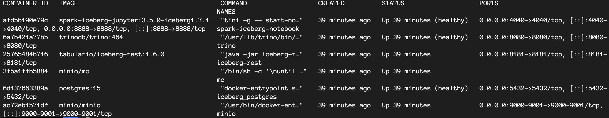
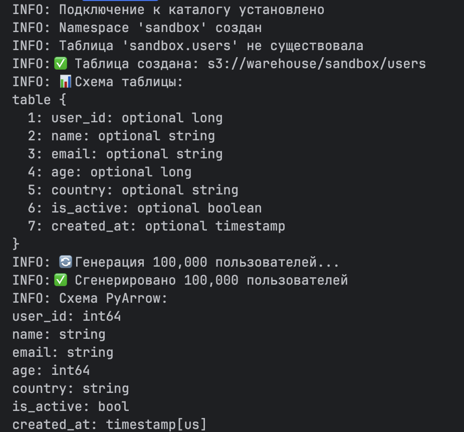
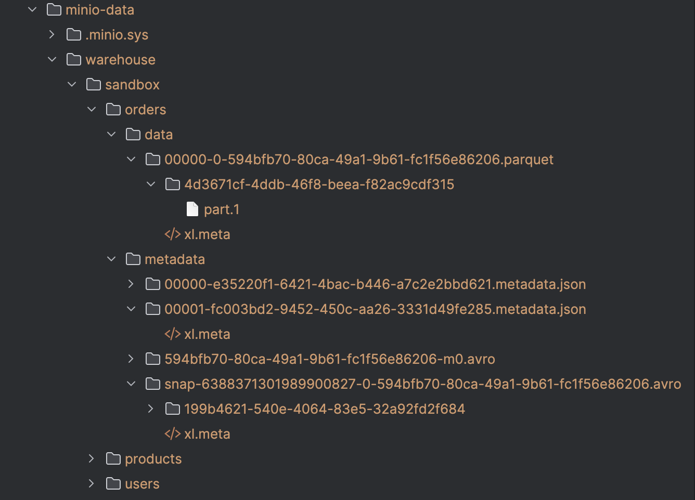
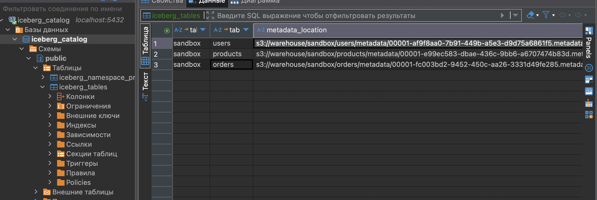
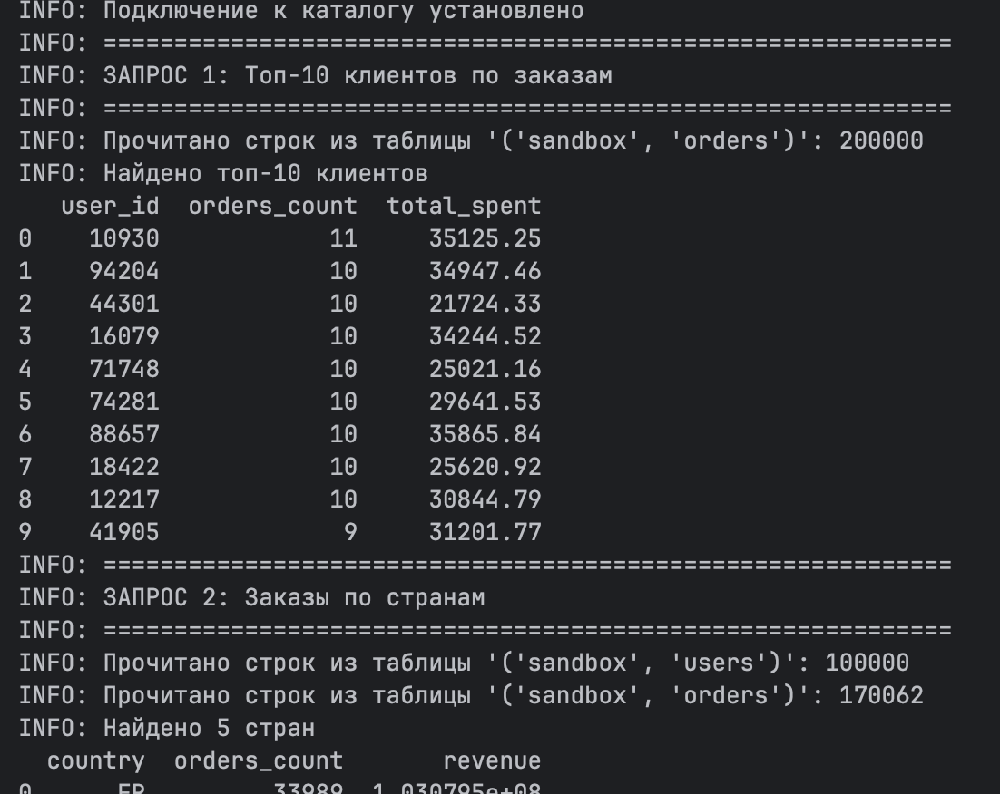
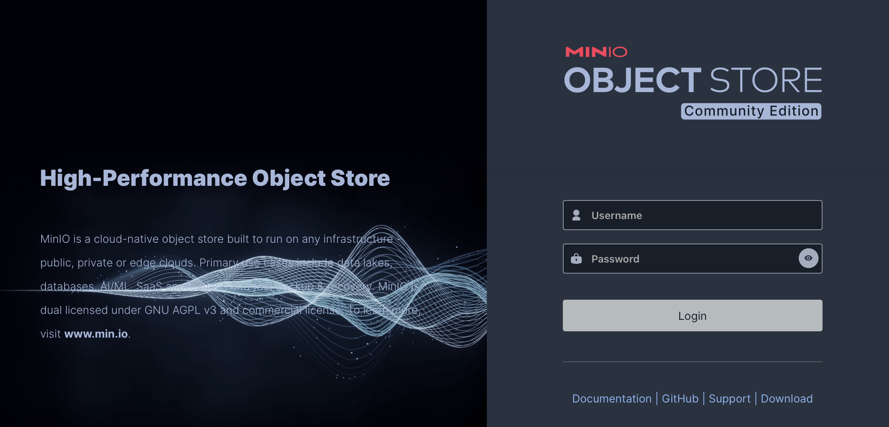
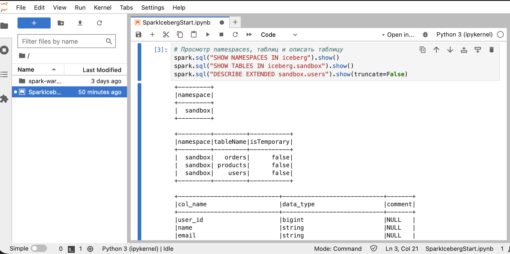
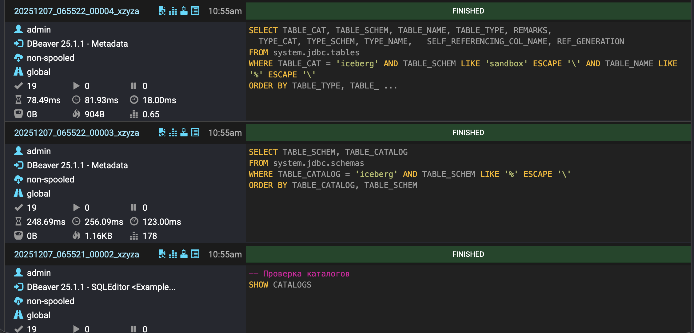

# Настройка локальной среды Data LakeHouse для изучения работы с Apache Iceberg   
   

Этот проект представляет собой локальную среду поднятую в Docker контейнерах, для изучения работы с Apache Iceberg, далее
создаем и наполняем тестовую базу из нескольких таблиц для аналитических запросов, изучаем работу движков(клиентов) Spark, Trino, PyIceberg.   

**Это не инструкция, а скорее заметка собранная во время изучения**

## Инфраструктура docker-compose
- Apache Iceberg REST Catalog (порт 8181) — Управление таблицами 
- MinIO (S3-совместимое хранилище) (порт 9000-9001) — Хранилище данных      
- PostgreSQL (метаданные) (порт 5432) — Метаданные  
- Apache Spark + Jupyter (8888-4040) — Обработка данных   
- Trino (SQL engine) (порт 8080) — SQL движок   

## Описание файлов 
### **CreateTestData.py**  
Модуль создает набор тестовых данных для демонстрации работы с Apache Iceberg.        
Генерирует 3 связанные таблицы в стиле e-commerce: 200k пользователей, 10k товаров, 200k заказов  

### **ExampleWorkWithIcebergPyiceberg.py**
PyIceberg это Python библиотека для прямой работы с таблицами Apache Iceberg без необходимости запуска JVM-кластеров (Spark, Trino).   
Основной модуль с функциями:    
1)Подключение к каталогу   
2)CRUD операции (Create, Read, Update, Delete)  
3)Батч-запись данных  
4)Time-travel (откат версий)  

### **AnalyticsQueriesPyiceberg.py**
7 готовых аналитических запросов:    
1)Топ клиенты по заказам   
2)Заказы по странам  
3)Дорогие товары  
4)Динамика по месяцам  
5)Популярные категории  
6)Крупные заказы  
7)Статистика по платежам  

### **ExampleWorkWithTrino.sql**  
Примеры CRUD SQL операций для работы с Iceberg таблицами через Trino  

### **SparkIcebergStart.ipynb**
Jupyter Notebook в котором показано, как работать с Apache Iceberg от подключения к каталогу до чтения, записи и анализа данных через Spark

# Практика
## Установка локальных зависимостей
~~~
python3 -m venv .venv
pip install -r requirements.txt 
~~~  

## Сборка --no-cache
~~~
docker build --no-cache -f DockerfileSparkIcebergJupyter -t spark-iceberg-jupyter:3.5.0-iceberg1.7.1 .
~~~

## Запуск 
~~~
docker compose up -d 
~~~

## Запуск скрипта CreateTestData.py для создания тестовых таблиц с данными
~~~
python3 CreateTestData.py
~~~
   
**После запуска в S3 получаем такую структуру**    

  

**Проверяем базу метаданных**

## Запуск скрипта AnalyticsQueriesPyiceberg.py для проверки аналитических запросов
~~~
python3 AnalyticsQueriesPyiceberg.py
~~~

# UI S3
http://localhost:9001/   
admin   
password   
   

# Работа с Iceberg через Spark   
На этом моменте структура Data Lakehouse создана переходим в Jupyter для работы со Spark в файл SparkIcebergStart.ipynb   
http://localhost:8888/   
   

# Работа с Iceberg через Trino   
http://localhost:8080/   
1)Логин admin   
2)Добавляем соединение с Trino через DBeaver и работаем с файлом ExampleWorkWithTrino.sql   
   

# Удаление 
~~~
rm -rf pg-data
rm -rf minio-data
docker compose down -v
docker rmi spark-iceberg-jupyter:3.5.0-iceberg1.7.1
~~~
