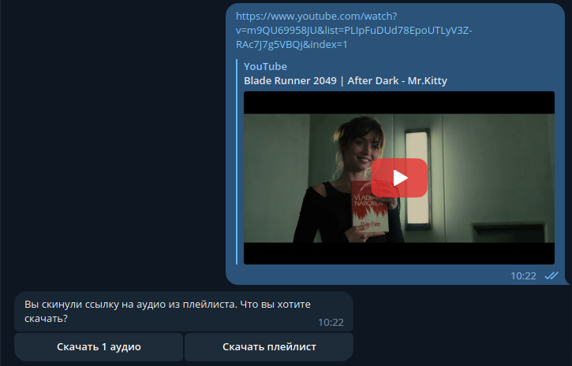
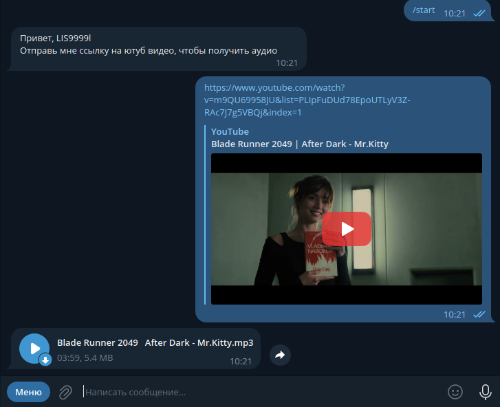
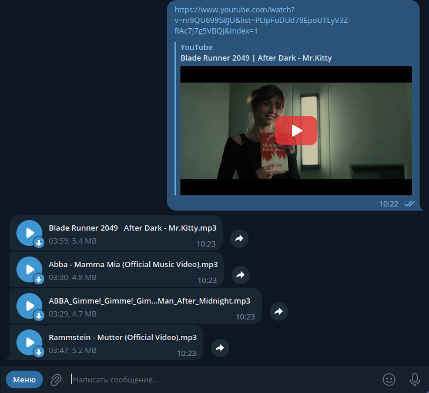
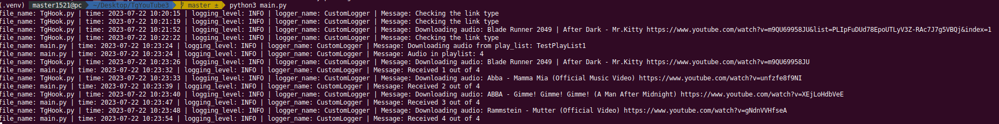
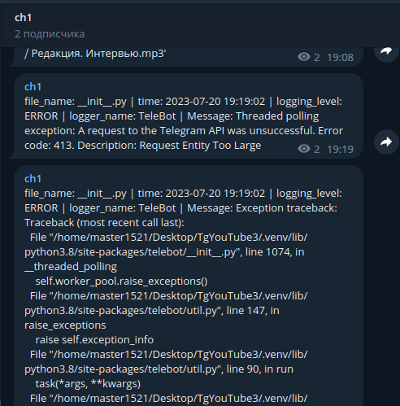

# Telegram бот для загрузки музыки c youtube 

## Возможности:
- Загружает аудио из видео на ютубе по ссылке
- Загружает все аудио из плейлиста
- Использую для миграции плейлистов из ютуба в телегу

### Если ссылка на песню из плейлиста, будет предложено выбрать что скачать

### Загружает 1 аудио по ссылке

### Загружает все аудио из плейлиста

### Настраиваем загрузку аудио
- Формат
- Качество
- Тайтл
- Логирование
~~~
def get_audio(url):
    ydl_opts = {
        'logger': MyLogger(),
        'format': 'bestaudio/best',
        'paths': {'home': HOME_DIR},
        'noplaylist': True,
        'outtmpl': {'default': '%(title)s.%(ext)s'},
        'postprocessors': [{
            'key': 'FFmpegExtractAudio',
            'preferredcodec': 'mp3',
            'preferredquality': '192',
        }],
    }

    with yt_dlp.YoutubeDL(ydl_opts) as ydl:
        try:
            video_info = ydl.extract_info(url=url, download=False)
            downloaded_file_path = ydl.prepare_filename(video_info).replace('.webm', '.mp3')
            info_logger.info(f"Downloading audio: {video_info['title']} {url}")
            ydl.download(url_list=[url])
            return downloaded_file_path
        except Exception:
            info_logger.error(f"Can't download audio: {url}", exc_info=True)
            pass
~~~

### Отправить аудио в tg
Файл должен быть открыт в бинарном виде, перед отправкой
~~~
def send_audio_to_tg(audio_path, chat_id):
    with open(file=audio_path, mode='rb') as f:
        bot.send_audio(chat_id=chat_id, audio=f)
~~~

## Логирование и уведомление по ошибкам
Добавляю пользовательское логирование и свой хендлер для отправки уведомлений по ошибкам в tg канал.
Так же сюда можно добавить отдельные обработчики для записи логов в файл.
~~~
class MyLogger:
    def debug(self, msg):
        pass

    def info(self, msg):
        pass

    def warning(self, msg):
        print(msg)

    def error(self, msg):
        print(msg)

class TelegramBotHandler(Handler):
    def __init__(self, token: str, chat_id: str):
        super().__init__()
        self.token = token
        self.chat_id = chat_id

    def emit(self, record: LogRecord):
        bot = telebot.TeleBot(self.token)
        bot.send_message(
            self.chat_id,
            self.format(record)
        )

def filter_tg(record: LogRecord) -> bool:
    if 'infinity polling' in record.getMessage().lower():
        return False
    else:
        return True

formatter = logging.Formatter(
    fmt='file_name: {filename} | time: {asctime} | logging_level: {levelname} | logger_name: {name} | Message: {message}',
    style='{', datefmt='%Y-%m-%d %H:%M:%S')

tg_handler = TelegramBotHandler(token=TOKEN, chat_id=str(CHANNEL_CH1))
tg_handler.setFormatter(formatter)
tg_handler.addFilter(filter_tg)

info_logger = logging.getLogger(__name__)
info_logger.setLevel(logging.INFO)

info_handler = logging.StreamHandler(stream=sys.stdout)
info_logger.addHandler(info_handler)
info_handler.setFormatter(formatter)
~~~

### Вывод лога в консоль

### Сообщения по ошибкам будут приходить в специальный админский канал

## Логика работы бота
Добавляем кнопки и обработчики

### Стартовая команда
~~~
@bot.message_handler(commands=["start"])
def echo(massage: Message):
    bot.send_message(chat_id=massage.chat.id, text=f"Привет, {massage.from_user.username} \n"
                                                f"Отправь мне ссылку на ютуб видео, чтобы получить аудио")
~~~

### Обработка ссылок и логика загрузки
- Определяем тип ссылки
- Добавляем кнопки 
- Обработка простых ссылок на 1 видео
~~~
@bot.message_handler(regexp='https://www.youtube.com.*')
def command_help(message: Message):
    global url_from_user
    url_from_user = message.text

    if link_from_playlist(message.text):
        markup = types.InlineKeyboardMarkup()
        bt1 = types.InlineKeyboardButton(text='Скачать 1 аудио', callback_data='get_audio')
        bt2 = types.InlineKeyboardButton(text='Скачать плейлист', callback_data='get_playlist')
        markup.row(bt1, bt2)

        bot.send_message(chat_id=message.chat.id, text="Вы скинули ссылку на аудио из плейлиста. Что вы хотите скачать?",
                         reply_markup=markup)
    else:
        whait_message = bot.send_message(chat_id=message.chat.id, text="Скачиваю...")
        song_title = get_audio(url_from_user)
        send_audio_to_tg(audio_path=song_title, chat_id=message.chat.id)
        bot.delete_message(chat_id=whait_message.chat.id, message_id=whait_message.id)
        os.remove(song_title)
~~~

### Обработчик вызовов
- Обрабатываем команды пользователя из callback
- Запускает загрузку и отправку в tg
~~~
@bot.callback_query_handler(func=lambda callback: True)
def collback_message(callback: CallbackQuery):
    bot.delete_message(chat_id=callback.message.chat.id, message_id=callback.message.id)

    if callback.data == 'get_audio':
        whait_message = bot.send_message(chat_id=callback.message.chat.id, text="Скачиваю...")
        song = get_audio(url_from_user)
        send_audio_to_tg(audio_path=song, chat_id=callback.message.chat.id)
        bot.delete_message(chat_id=whait_message.chat.id, message_id=whait_message.id)
        os.remove(song)
    elif callback.data == 'get_playlist':
        whait_message = bot.send_message(chat_id=callback.message.chat.id, text="Скачиваю...")

        play_list = Playlist(url=url_from_user)
        if play_list:
            info_logger.info(f'Downloading audio from play_list: {play_list.title}')
            info_logger.info(f'Audio in playlist: {len(play_list.video_urls)}')

            count = 0
            for video_url in play_list.video_urls:
                try:
                    song = get_audio(video_url)
                    send_audio_to_tg(audio_path=song, chat_id=callback.message.chat.id)
                    os.remove(song)
                except KeyError:
                    bot.send_message(chat_id=callback.message.chat.id, text="Ограниченный доступ у плейлиста.")
                    pass
                except Exception as err:
                    info_logger.error(f"Can't download audio: {video_url}", exc_info=True)
                    pass
                finally:
                    count += 1
                    info_logger.info(f'Received {count} out of {len(play_list.video_urls)}')
        else:
            bot.send_message(chat_id=callback.message.chat.id, text="Плейлист должен быть доступен по ссылке")
        bot.delete_message(chat_id=whait_message.chat.id, message_id=whait_message.id)
~~~

**Заметки:**
1) Этот бот я делал для миграции своих плейлистов и загрузки музыки без потери качества аудио, он не подходит для загрузки больших видео, стримов и под кастов.
Технически он будет скачивать аудио из видео любых размеров на локале, он не сможет их отправить в tg из-за лимита на отправку файлов в 50мб.
Нужно дорабатывать модуль сжатия аудио.  
2)Тайтлы видео на ютубе могут быть в любом формате: спец символы, знаки, смайлики, кириллица и тд.. Это создает проблемы с неймингом и путями к файлам на локалке, лучше хешировать перед сохранением.

