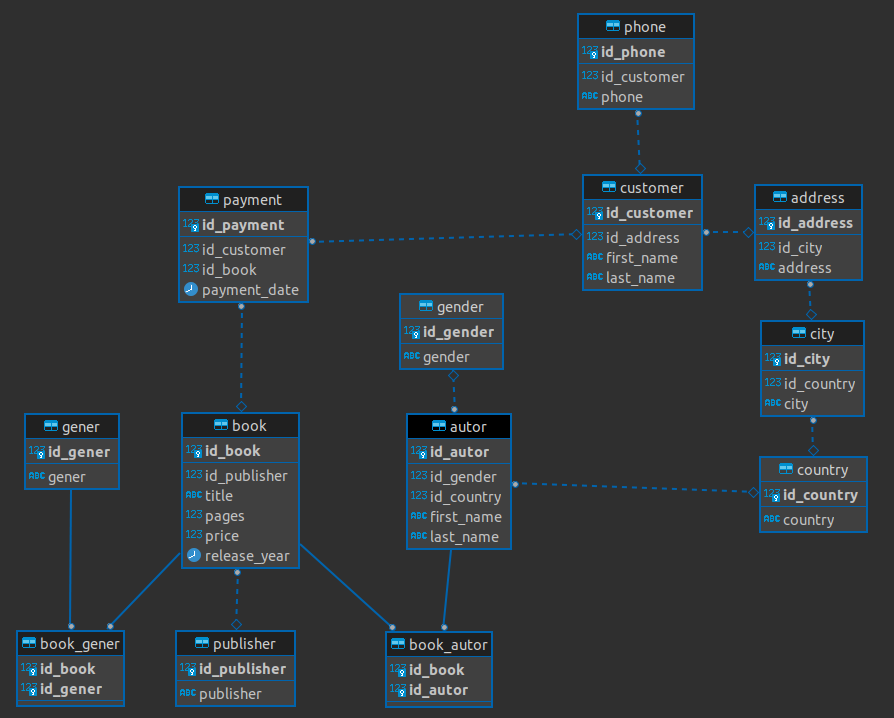

# База для книг

Проектирование и наполнение нормализованной базы для книг (мини версия).  
Данные были сгенерированны с помощью библиотеки Faker

~~~
import psycopg2  
import x_config  
from random import randint  
from faker import Faker  

fake = Faker(['ru_RU'])
~~~

## Схема базы

## Создаем таблицы

~~~
try:
	connection = psycopg2.connect(dbname=x_config.dbname, user=x_config.user, password=x_config.password,host=x_config.host, port=x_config.port)
	print(f'[INFO] Соединение с базой открыто')
	connection.autocommit = True

	with connection.cursor() as cursor:
	cursor.execute(
		"""CREATE TABLE "dim".gender (
		id_gender serial PRIMARY KEY
		,gender varchar(10)) """
	),
	cursor.execute(
		"""CREATE TABLE "dim".country (
		id_country serial PRIMARY KEY
		,country varchar(50) NOT NULL) """
	),
	cursor.execute(
		"""CREATE TABLE "dim".city (
		id_city serial PRIMARY KEY
		,id_country integer NOT NULL REFERENCES book."dim".country (id_country)
		,city varchar(50) NOT NULL) """
	),
	cursor.execute(
		"""CREATE TABLE "dim".address (
		id_address serial PRIMARY KEY
		,id_city integer NOT NULL REFERENCES book."dim".city (id_city)
		,address varchar(200) NOT NULL) """
	),
	cursor.execute(
		"""CREATE TABLE "dim".autor (
		id_autor serial PRIMARY KEY
		,id_gender INTEGER NOT NULL REFERENCES book."dim".gender (id_gender)
		,id_country INTEGER NOT NULL REFERENCES book."dim".country (id_country)
		,first_name varchar(100) NOT NULL
		,last_name varchar(100) NOT NULL) """
	),
	cursor.execute(
		"""CREATE TABLE "dim".customer (
		id_customer serial PRIMARY KEY
		,id_address integer NOT NULL REFERENCES book."dim".address (id_address)
		,first_name varchar(50) NOT NULL
		,last_name varchar(50) NOT NULL) """
	),
	cursor.execute(
		"""CREATE TABLE "dim".phone (
		id_phone serial PRIMARY KEY
		,id_customer integer NOT NULL REFERENCES book."dim".customer (id_customer)
		,phone varchar(50) NOT NULL) """
	),
	cursor.execute(
		"""CREATE TABLE "dim".publisher (
		id_publisher serial PRIMARY KEY
		,publisher varchar(100) NOT NULL) """
	),
	cursor.execute(
		"""CREATE TABLE "dim".gener (
		id_gener serial PRIMARY KEY
		,gener varchar(50) NOT NULL) """
	),
	cursor.execute(
		"""CREATE TABLE "dim".book (
		id_book serial PRIMARY KEY
		,id_publisher integer NOT NULL REFERENCES book."dim".publisher (id_publisher)
		,title varchar(100) NOT NULL
		,pages integer NOT NULL
		,price integer NOT NULL
		,release_year date NOT NULL CHECK (release_year < now()::date)) """
	),
	cursor.execute(
		"""CREATE TABLE "dim".book_autor (
		id_book integer NOT NULL
		,id_autor integer NOT NULL
		,PRIMARY KEY (id_book, id_autor)
		,FOREIGN KEY (id_book) REFERENCES book."dim".book (id_book)
		,FOREIGN KEY (id_autor) REFERENCES book."dim".autor (id_autor)) """
	),
	cursor.execute(
		"""CREATE TABLE "dim".book_gener (
		id_book integer NOT NULL
		,id_gener integer NOT NULL
		,PRIMARY KEY (id_book, id_gener)
		,FOREIGN KEY (id_book) REFERENCES book."dim".book (id_book)
		,FOREIGN KEY (id_gener) REFERENCES book."dim".gener (id_gener)) """
	),
	cursor.execute(
		""" CREATE TABLE "dim".payment (
		id_payment serial PRIMARY KEY
		,id_customer integer NOT NULL REFERENCES book."dim".customer (id_customer)
		,id_book integer NOT NULL REFERENCES book."dim".book (id_book)
		,payment_date date NOT NULL) """)

except Exception as _ex:  
	print("[INFO] Error while working with PostgreSQL", _ex)  
finally:  
	if connection:  
		connection.close()  
		print("[INFO] Соединение с базой закрыто")  
~~~

## Генерируем и вставляем данные в таблицы

~~~
try:
	connection = psycopg2.connect(dbname=x_config.dbname, user=x_config.user, password=x_config.password,host=x_config.host, port=x_config.port)
	print(f'[INFO] Соединение с базой открыто')
	connection.autocommit = True

	with connection.cursor() as cursor:
	cursor.execute(
		f"""INSERT INTO "dim".gender (gender)
		VALUES
			('Male')
			,('Female')
		"""),
	for i in range(1000):
		cursor.execute(
			f"""INSERT INTO "dim".country (country)
			   VALUES
				   ('{fake.country()}')
			   """),
	for i in range(2000):
		cursor.execute(
			f"""INSERT INTO "dim".autor ( id_gender, id_country, first_name, last_name)
			VALUES
				( '{randint(1,2)}', '{randint(1,1000)}', '{fake.first_name()}', '{fake.last_name()}')
			"""),
	for i in range(1000):
		cursor.execute(
			f"""INSERT INTO "dim".city ( id_country, city)
			VALUES
				( '{randint(1, 1000)}', '{fake.city()}')
			"""),
	for i in range(1000):
		cursor.execute(
			f"""INSERT INTO "dim".address ( id_city, address)
			VALUES
				( '{randint(1, 1000)}', '{fake.address()}')
			"""),
	for i in range(1000):
		cursor.execute(
			f"""INSERT INTO "dim".customer ( id_address, first_name, last_name)
			VALUES
				( '{randint(1, 1000)}', '{fake.first_name()}', '{fake.last_name()}')
			"""),
	for i in range(1500):
		cursor.execute(
			f"""INSERT INTO "dim".phone ( id_customer, phone)
			VALUES
				( '{randint(1, 1000)}', '{fake.phone_number()}')
			"""),
	for i in range(50):
		cursor.execute(
			f"""INSERT INTO "dim".publisher ( publisher )
			VALUES
				( '{fake.company()}')
			"""),
	gener = "Action Animation Children Classics Comedy Documentary Drama Family Foreign Games Horror Music New Sci-Fi Sports Travel Anime Family Animal Detectiv NonFiction Fiction Siens".split()
	for i in gener:
		cursor.execute(
			f"""INSERT INTO "dim".gener ( gener )
			VALUES
				( '{i}')
			"""),
	for i in range(3000):
		cursor.execute(
			f"""INSERT INTO "dim".book ( id_publisher, title, pages, price, release_year)
			VALUES
				( '{randint(1, 50)}', '{fake.word().title()}', '{randint(80, 500)}', '{randint(100, 1500)}', '{fake.date(pattern="%Y-%m-%d")}')
			"""),
	for i in range(1000):
		cursor.execute(
			f"""INSERT INTO "dim".payment ( id_customer, id_book, payment_date )
			VALUES
				( '{randint(1,1000)}', '{randint(1, 3000)}', '{fake.date(pattern="%Y-%m-%d")}')
			""")
	for i in range(2000):
		try:
			cursor.execute(
				f"""INSERT INTO "dim".book_autor ( id_book, id_autor )
				VALUES
					( '{randint(1,2000)}', '{randint(1, 1000)}')
				""")
		except:
			pass
	for i in range(1500):
		try:
			cursor.execute(
				f"""INSERT INTO "dim".book_gener ( id_book, id_gener )
				VALUES
					( '{randint(1,3000)}', '{randint(1, 16)}')
				""")
		except:
			pass

except Exception as _ex:  
	print("[INFO] Error while working with PostgreSQL", _ex)  
finally:  
	if connection:  
		connection.close()  
		print("[INFO] Соединение с базой закрыто")  
~~~

## SQL запросы для прверки 

** Список из покупателей которые купиль больше всего книг.  
Посчитайсе минимальный, средний, максимальный платеж и сумму всех платежей для каждого покупателя **

~~~
--EXPLAIN ANALYZE 
SELECT
--	c.id_customer 
	c.first_name
	,c.last_name
	,min(b.price) AS min_payment
	,round(avg(b.price), 2) AS avg_payment
	,max(b.price) AS max_payment
	,sum(b.price) AS sum_all_payment
	,count(p.id_payment) AS count_payment
FROM payment p
LEFT JOIN book b ON p.id_book = b.id_book
LEFT JOIN customer c ON p.id_customer = c.id_customer 
GROUP BY c.id_customer 
ORDER BY count_payment DESC
LIMIT 10
~~~

**Список из 10 самых продоваемых книг**
~~~
SELECT
	b.id_book
	,b.title
	,count(p.id_payment) AS books_sold
FROM payment p
LEFT JOIN book b ON b.id_book = p.id_book
GROUP BY b.id_book
ORDER BY books_sold DESC
LIMIT 10
~~~

**Список из 10 самых продоваемых авторов**
~~~
WITH autor_x AS (
SELECT 
	id_book
	,a.first_name
	,a.last_name
FROM book_autor ba 
LEFT JOIN autor a ON a.id_autor = ba.id_autor
), book_x AS (
SELECT
	p.id_book 
	,count(p.id_payment)
FROM payment p
GROUP BY p.id_book
ORDER BY 2 DESC
)
SELECT
	a.first_name 
	,a.last_name
	,b.count
FROM book_x b
LEFT JOIN autor_x a ON b.id_book = a.id_book 
ORDER BY count desc 
~~~

**Список из 10 городов, где больше всего покупают книги**
~~~
SELECT
	t.city
	,count(p.id_payment)
FROM payment p
LEFT JOIN (
	SELECT 
		c.id_customer
		,c2.city
	FROM customer c
	LEFT JOIN address a ON c.id_customer = a.id_address
	LEFT JOIN city c2 ON a.id_city = c2.id_city) AS t ON t.id_customer = p.id_customer
GROUP BY t.city
ORDER BY 2 DESC
LIMIT 10
~~~

**Список из 10 самых популярных жанров**
~~~
WITH gener_cte AS (
SELECT
	bg.id_book
	,g.gener 
FROM book_gener bg 
LEFT JOIN gener g ON g.id_gener = bg.id_gener
)
SELECT
	gener
	,count(p.id_book)
FROM payment p
LEFT JOIN gener_cte gc ON gc.id_book = p.id_book 
GROUP BY gener
ORDER BY 2 DESC
LIMIT 10
~~~

**Посчитайте количество продаж по годам**
~~~
SELECT 
	EXTRACT(YEAR FROM payment_date) AS sales_year
	,count(id_payment)
FROM dim.payment
GROUP BY sales_year
ORDER BY sales_year ASC
~~~

**Последние 2 платежа для клиентов**
~~~
WITH t AS (
SELECT 
	id_customer
	,b.price
	,payment_date
	,ROW_NUMBER () OVER (PARTITION BY p.id_customer ORDER BY payment_date DESC)
FROM payment p
LEFT JOIN book b ON b.id_book = p.id_book 
)
SELECT * FROM t
WHERE ROW_NUMBER <= 2 
~~~

