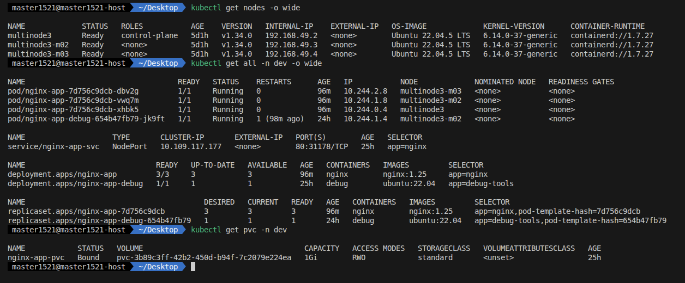
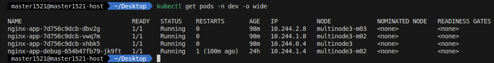
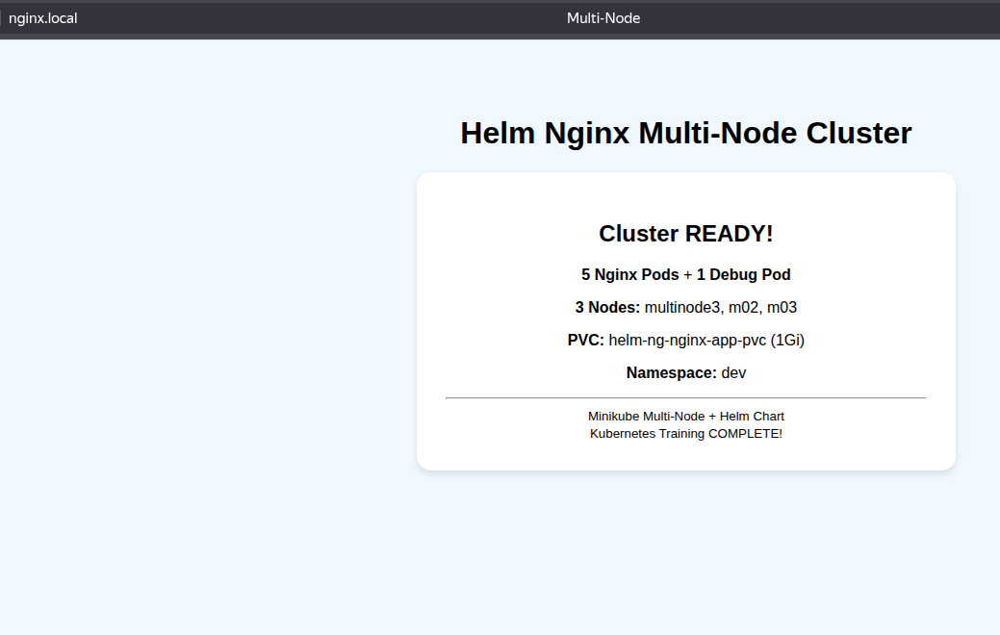
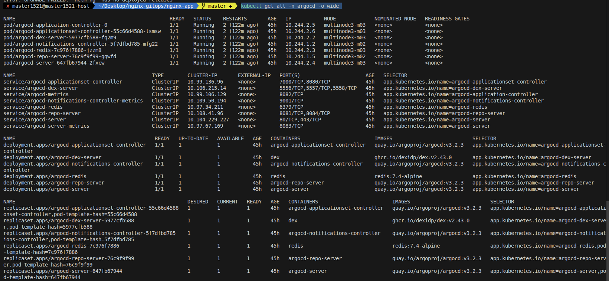
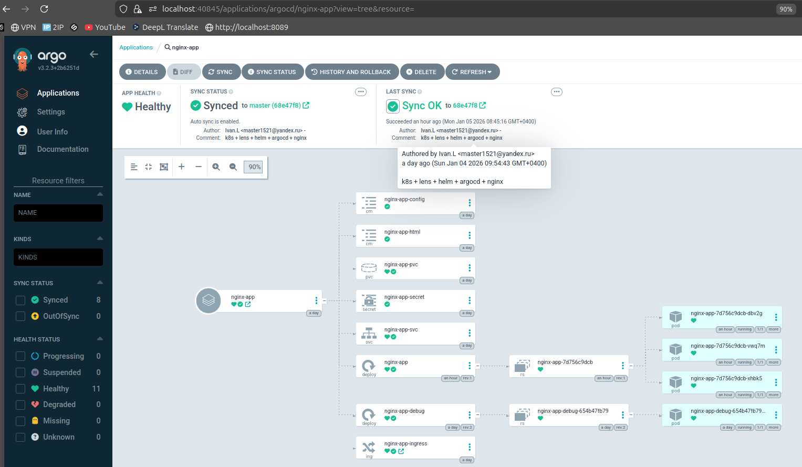
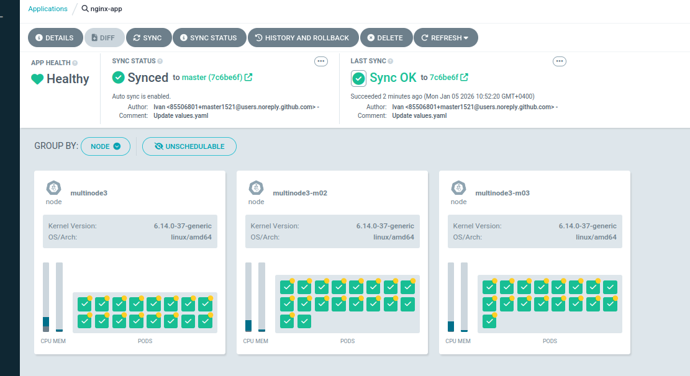
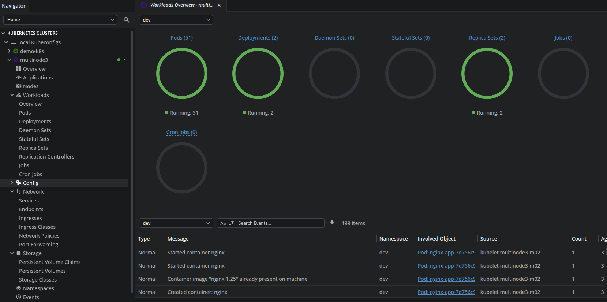

# Стенд для изучения K8S + Minikube + Helm + ArgoCd (Continuous Delivery) 

Запускаем кластер K8S через Minikube с 3 нодами, упаковываем приложение nginx в Helm Charts и подключаем автоматический деплой через ArgoCD 

**Это не инструкция, а заметки с обучения!!!**

## СТРУКТУРА ПРОЕКТА
~~~
├── argocd
│   ├── argocd-application.yaml
│   └── argo-install.yaml
├── nginx-app
│   ├── charts
│   ├── Chart.yaml
│   ├── templates
│   │   ├── configmap-nginx.yaml
│   │   ├── debug-deployment.yaml
│   │   ├── deployment-nginx.yaml
│   │   ├── _helpers.tpl
│   │   ├── html-configmap.yaml
│   │   ├── ingress-nginx.yaml
│   │   ├── pvc-nginx.yaml
│   │   ├── secret-nginx.yaml
│   │   └── service-nginx.yaml
│   ├── values-dev.yaml
│   └── values.yaml
└── README.md
~~~

Кратко по файлам (это всё манифесты/шаблоны Helm для k8s):  
- `configmap-nginx.yaml` – ConfigMap с настройками nginx
- `debug-deployment.yaml` – Deployment для debug (утилиты, отладка сети/приложения).   
- `deployment-nginx.yaml` – основной Deployment nginx‑приложения
- `_helpers.tpl` – вспомогательные шаблоны Helm (
- `html-configmap.yaml` – ConfigMap с HTML‑контентом (страницы сайта, index.html и т.п.).   
- `ingress-nginx.yaml` – Ingress‑ресурс для внешнего доступа к nginx по домену/URL.   
- `pvc-nginx.yaml` – PersistentVolumeClaim для хранения данных nginx (логов, статики и др.).   
- `secret-nginx.yaml` – Secret с чувствительными данными (пароли, TLS‑сертификаты и т.п.) Такое на прод и в git не выкладываем!   
- `service-nginx.yaml` – Service, который открывает доступ к pod nginx внутри кластера   
`argo-install.yaml` - ArgoCD сервисы для установки  
`argocd-application.yaml` - Приложение argocd для nginx-app       
`values.yaml` - Пользовательские переменные для helm 

## СОЗДАНИЕ И НАСТРОЙКА КЛАСТЕРА MINIKUNE
1)Создать 3-нодовый кластер с ресурсами
~~~
minikube start \
  --nodes 3 \
  --cpus 2 \
  --memory 4096 \
  --driver=docker \
  --container-runtime=containerd \
  -p multinode3
~~~

Проверить кластер
~~~
kubectl get nodes -o wide
~~~

2)Включить  
2.1) Storage provisioner (для PVC)
~~~  
minikube addons enable storage-provisioner -p multinode3
~~~

2.2) Default storage class (автоматическое назначение PVC)   
~~~
minikube addons enable default-storageclass -p multinode3
~~~

2.3) Metrics server (мониторинг ресурсов)
~~~
minikube addons enable metrics-server -p multinode3
~~~

2.4) Включить ingress
~~~
minikube addons enable ingress -p multinode3
~~~

## УСТАНОВКА NGINX
**Заметка этот блок не нужен если хотим запускать через Argo**   
1)Создаем неймспейс dev   
~~~
kubectl create ns dev   
~~~

2)Развертываю чарт
~~~
cd nginx-app
helm upgrade --install helm-ng . -n dev --values values.yaml
~~~

3)Првоерка   
~~~
kubectl get nodes -o wide
kubectl get all -n dev -o wide
kubectl get pvc -n dev
~~~

Распределение подов по нодам
~~~
kubectl get pods -n dev -o wide
~~~

4)Обновить реплику
~~~
helm upgrade helm-ng . --set replicaCount=10 -n dev
~~~

5)Добавить проброс портов   
Port-forward и тест  
Проверяем http://localhost:8080
~~~
kubectl port-forward service/helm-ng-nginx-app-svc 8080:80 -n dev
~~~
или ingress на http://nginx.local/ в /etc/hosts
192.168.49.2 nginx.local

Проверить UI nginx

6)Заходим в поду дебага для проверки  
В этой поде установлены пакеты для сетевых проверок vim git tree wget htop net-tools iputils-ping traceroute iproute2 curl dnsutils
~~~
kubectl exec -it deployment.apps/nginx-app-debug -n dev -- bash
~~~

Проверка сети
~~~
ping 8.8.8.8 -c 5
curl http://nginx-app-svc.dev.svc.cluster.local
htop
~~~

7)Мониторинг ресурсов ноды и под
~~~
kubectl top nodes
kubectl top pods -n dev
~~~

8)Посмотреть историю ревизий
~~~
helm history <release> -n <ns>
helm history helm-ng -n dev
~~~

Откатить релиз к указанной ревизии   
~~~
helm rollback <release> <revision> -n <ns>
helm rollback helm-ng 1 -n dev
~~~

Остановить/Запустить кластер
~~~
minikube stop -p multinode3
minikube start -p multinode3
~~~

**Удаление и очистка**
Для работы с ArgoCD локальные релизы helm не нужны, удаляем все
~~~   
kubectl get all -n dev -o wide 
helm list -n dev
helm uninstall helm-ng -n dev
kubectl delete pvc -n dev --all
kubectl delete namespace dev
kubectl create namespace dev
~~~

## УСТАНОВКА ARGOCD
**Заметки по установке**

Стандартная установка из доки не работает! Надо поменять образ 
~~~
kubectl apply -n argocd -f https://raw.githubusercontent.com/argoproj/argo-cd/stable/manifests/install.yaml
~~~
~~~
Failed to pull image "public.ecr.aws/docker/library/redis:8.2.2-alpine": rpc error: code = Canceled desc = failed to pull and unpack image "public.ecr.aws/docker/library/redis:8.2.2-alpine": context canceled.
~~~

Создать неймспайс   
~~~
kubectl create namespace argocd
kubectl create namespace dev
~~~

Скачать файл для правок
~~~
curl -o argo-install.yaml https://raw.githubusercontent.com/argoproj/argo-cd/stable/manifests/install.yaml
~~~

Ищем проблемный образ в файле и заменяем 
~~~  
grep -n "public.ecr.aws/docker/library/redis" argo-install.yaml
~~~
**25599:        image: public.ecr.aws/docker/library/redis:8.2.2-alpine**   
Заменить на image: redis:7.4-alpine

Установка ресурсов argocd.  
~~~
kubectl apply -n argocd -f argo-install.yaml
~~~

Проверяем после установки   
Проверяем после установки   
~~~
kubectl get all -n argocd -o wide
~~~

Получи пароль UI Argo   
Lens можно посмотреть в argocd-initial-admin-secret   
или через команду   
~~~
kubectl -n argocd get secret argocd-initial-admin-secret -o jsonpath="{.data.password}" | base64 -d && echo
~~~

Делаем проброс портов для UI   
Через Lens в argocd-server
или
kubectl port-forward svc/argocd-server -n argocd 8080:443

Настройка доступа GitHub в ArgoCd
Settings >> Repositories 
На локальной машине создаем SSH и добавляем в GitHub в Deploy keys проекта где лежат чарты и какую репу будет мониторить ArgoCd, так же в UI ArgoCd добавляем приватный ключ в подключение

Создать приложение в ArgoCD через yaml
~~~    
# argocd-application.yaml
apiVersion: argoproj.io/v1alpha1  # API версия Argo CD Application CRD
kind: Application                  # Тип ресурса Kubernetes - Application
metadata:
  name: nginx-app                  # Имя приложения (отображается в Argo CD UI)
  namespace: argocd                # Namespace где хранится Application (всегда argocd)
spec:
  project: default                 # Argo CD Project для группировки приложений и RBAC

  # Git репозиторий - источник манифестов
  source:
    repoURL: git@github.com:master1521/nginx-gitops.git  # URL Git репозитория (SSH формат)
    targetRevision: master           # Ветка/тег/commit для деплоя (main, v1.0.0, abc123)
    path: nginx-app                # Путь к Helm chart внутри репозитория. Указываешь путь к корню Helm chart. nginx-app/ содержит Chart.yaml → это корень Helm chart
    helm:                          # Настройки для Helm chart
      valueFiles:
      - values.yaml                # Файл с переменными Helm (можно несколько)

  # Kubernetes кластер - куда деплоить
  destination:
    server: https://kubernetes.default.svc  # URL Kubernetes API (default.svc = текущий кластер)
    namespace: dev                 # Namespace для деплоя приложения

  # Автосинхронизация - политика синхронизации
  syncPolicy:
    automated:                     # Включить автоматическую синхронизацию
      prune: true                  # Удалять ресурсы из кластера если их убрали из Git
      selfHeal: true               # Восстанавливать из Git при ручных изменениях (kubectl edit)
      allowEmpty: false            # Запретить синхронизацию если в Git нет ресурсов (защита от пустого деплоя)
    syncOptions:                   # Дополнительные опции синхронизации
    - CreateNamespace=true         # Автоматически создать namespace если его нет
    retry:                         # Настройки повторных попыток при ошибках
      limit: 5                     # Максимум 5 попыток синхронизации при ошибке
      backoff:                     # Экспоненциальная задержка между попытками
        duration: 5s               # Начальная задержка 5 секунд
        factor: 2                  # Увеличивать задержку в 2 раза (5s → 10s → 20s → 40s → 80s)
        maxDuration: 3m            # Максимальная задержка 3 минуты
      
~~~

**Важная заметка перед добавлением argocd-application.yaml нужно удалить релиз через helm, если он было создан, иначе AgroCd app будет падать по ошибке**
~~~
helm uninstall helm-ng -n dev
kubectl delete namespace dev
~~~

Применить манифест Application   
~~~
kubectl apply -f argocd/argocd-application.yaml
~~~

Проверить запуск сервисов   
~~~
kubectl get all -n argocd -o wide
~~~

Проверить в UI ArgoCd

Проверка ручного удаления   
Просле настройки Argo можно удалить все руками, поду, сервис, деплой, изменить скейл но ArgoCD откатит все как в Git
~~~
kubectl delete all,configmap,secret,pvc,ingress --all -n dev
~~~

Все правки через гит репу!    
Меняем в гите values.yaml скейл на 50 реплик nginx 
replicaCount: 50    
и проверяем Argo   

или через Lens видно 50 под nginx и 1 для дебага

Удалить все в неймспейсе  
~~~
kubectl delete all --all -n argocd
kubectl delete all,configmap,secret,ingress,pvc,serviceaccount,role,rolebinding --all -n argocd
kubectl get all -n argocd -o wide
kubectl delete namespace argocd
kubectl create namespace argocd
kubectl delete pod argocd-redis-5d59cb6947-z5tmz -n argocd --force --grace-period=0
~~~

